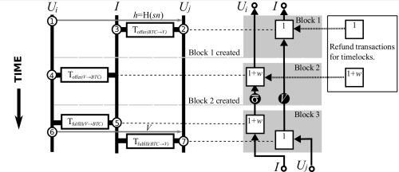

Although Bitcoin is often perceived to be an anonymous currency, research has shown that a user’s Bitcoin transactions can be linked to compromise the user’s anonymity. We present solutions to the anonymity problem for both transactions on Bitcoin’s blockchain and off the blockchain (in so called micropayment channel networks). We use an untrusted third party to issue anonymous vouchers which users redeem for Bitcoin. Blind signatures and Bitcoin transaction contracts (aka smart contracts) ensure the anonymity and fairness during the bitcoin ↔ voucher exchange. Our schemes are practical, secure and anonymous. - [Blindly Signed Contracts: Anonymous On-Blockchain and Off-Blockchain Bitcoin Transactions](https://eprint.iacr.org/2016/056.pdf)