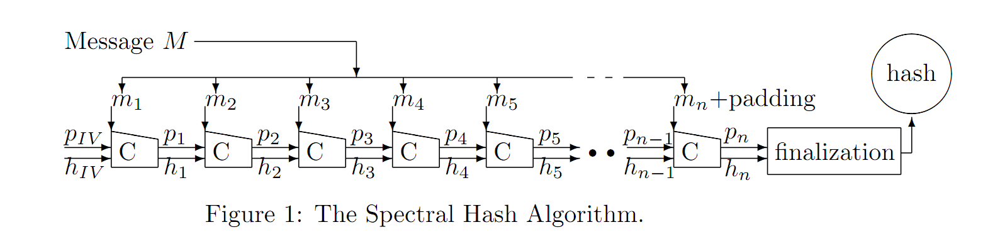
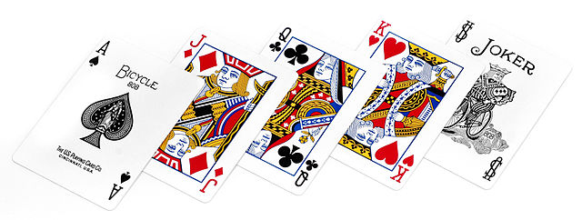

&#13;

While taking Ron Rivest's class<em> 6.857: Computer and Network Security </em>(an incredible class that I can't recommend enough to anyone interested in computer security) we were assigned to review the hash functions submitted to the NIST <a href="http://en.wikipedia.org/wiki/NIST_hash_function_competition">SHA-3 cryptographic hash function contest</a>. Each homework group received a list of four hash functions to review. I choose to review <a href="http://en.wikipedia.org/wiki/Spectral_Hash">Spectral Hash</a> as I found the name entertaining.  The page for the student reviews can be found <a href="http://courses.csail.mit.edu/6.857/2009/sha3.html">here</a>. A careful reader might notice that my team choose not to make our reviews public. This was because I thought I had discovered an attack against Spectral Hash and wanted time to double check my results. I was concerned that a programming error may have been responsible for the collisions I was finding. While it turned out that I had made a programming error it was also the case that my attack was correct. After further analysis I contacted the authors of Spectral Hash and released the pre-print <a href="http://www.blogger.com/Attacks%20Against%20Permute-Transform-Xor%20Compression%20Functions%20and%20Spectral%20Hash">Attacks Against Permute-Transform-Xor Compression Functions and Spectral Hash</a>.  

<strong>The Attack:</strong> The Spectral Hash <a href="http://en.wikipedia.org/wiki/Merkle%E2%80%93Damg%C3%A5rd_construction">compression function</a> (each $C$ in Figure 1 is a call to the compression function) takes three parameters: a message $m$, an array of numbers $p$, and the output of the previous call to the compression function $h$. This is how the compression function[^1] works:

<ol><li><strong>Permute:</strong> Take a block of the message $m$ and use it to permute/shuffle the array of numbers $p$.</li>&#13;
<li><strong>Transform:</strong> Use $p$ to generate a function $f$ to transform $m$</li>&#13;
<li><strong>Xor:</strong> Take $f(m)$ and the previous output $h$ xor them together and return this value as output.</li>&#13;
</ol>
The problem in Spectral Hash arises because each time you permute $p$ using $m$ therefore if you use the same $m$ you permute $p$ in exactly the same way. For an illustrative example consider a small deck of 5 cards. Ace=A, Jack=J, Queen=Q, K=King, and Joker=S.  

 Before we shuffle the cards they are in the following order [A, J, Q, K, S]. Lets say decide to perform the following shuffle (permute): we swap the first two cards, move the third card to the forth position, move the forth card to the fifth position and move the fifth card to the third position. The order of the deck will evolve like this: 
&#13;
<ul><li>[A, J, Q, K, S] &lt;-- (starting order of the deck)</li>&#13;
<li>[J, A, S, Q, K]</li>&#13;
<li>[A, J, K, S, Q]</li>&#13;
<li>[J, A, Q, K, S]</li>&#13;
<li>[A, J, S, Q, K]</li>&#13;
<li>[J, A, K, S, Q]</li>&#13;
<li>[A, J, Q, K, S] &lt;-- We've returned to the starting position after 6 shuffles.</li>&#13;
</ul>

It is a known rule of <a href="http://en.wikipedia.org/wiki/Group_theory">group theory</a> and card shuffling that applying the same permutation or shuffle over and over again will evidently return the deck it's starting position (that is, unshuffle the previous shuffles). The number of iterations required to return to the starting position is called the <a href="http://en.wikipedia.org/wiki/Order_(group_theory)">order</a> or period of the permutation. In our example our shuffle had an order of 5. Given a deck of $n$ cards the maximum possible order is given by the <a href="http://en.wikipedia.org/wiki/Landau's_function">Landau function.</a> As can be seen <a href="http://oeis.org/A000793">here</a>, for a decent sized $n$ the order can be quite large. In fact there is<a href="http://www.stackview.com/"> card deck shuffling simulation software for stage magicians</a> to model various shuffles [^1] used used in magic tricks.  The attack is simply this: find values of the message block $m$ that result in a permutation with a small order. Repeat these message blocks until $p$ returns to its starting state and continue providing the same value for $m$ until $h$ returns to initial value. Since two different values of $m$ will result in the same $h$, that is $h=IV$ you can generate arbitrary collisions[^2].

[^1]: The compression function defined in the [Spectral Hash specification](http://www.cs.ucsb.edu/~koc/shash/sHash.pdf) is not presented in this form. One of the results that I show in my paper is that Spectral Hash can be reformulated/reduced into this simple form. 

[^2]: The exact details are slightly more complicated than causing a collision in $h$ because Spectral Hash has a finalization function that protects against [length-extension attacks](http://www.vnsecurity.net/t/length-extension-attack/), but defeating the finalization function is only trivially harder.

