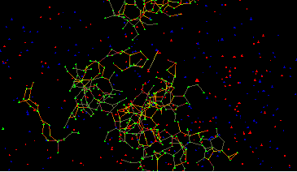
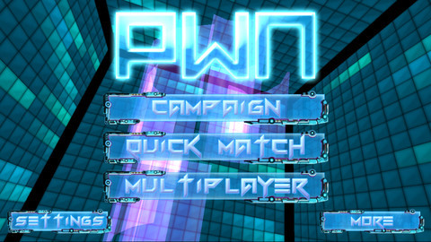
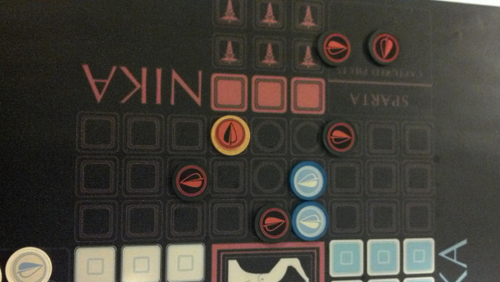

**Synthesis:**

[Synthesis is a very pretty game](http://synthesisgame.com/), but watching other people play it didn't look that engaging. Synthesis has to be played to be understood, it is strangely, oddly, engaging. It has serious [flow](https://en.wikipedia.org/wiki/Flow_(psychology)). Synthesis is a [continuous](https://en.wikipedia.org/wiki/Real_number) graph based [cellular automata](https://en.wikipedia.org/wiki/Cellular_automata) sandbox game. If you ever wasted a few hours playing with [Conway's Game of Life](https://en.wikipedia.org/wiki/Conway%27s_Game_of_Life), this is the game for you. It takes everything fun about clicking randomly, pushing start and seeing [unexpected emergent patterns](https://en.wikipedia.org/wiki/Emergent_properties) and turns it up to 11. For such a deep game the UI is simple but allows complex actions such as writing novel automata and introducing them into the world.  Think Steven Wolfram's [A New Kind of Science](https://en.wikipedia.org/wiki/A_New_Kind_of_Science) on DMT in game form. 

**PWN Combat Hacking:**

[PWN Combat Hacking](http://www.82apps.com/pwn/) has two players compete to take over (hack) nodes (computers) in a graph (network). The game plays and looks suspiciously like [the final hacker battle in the 1995 film Hackers](http://www.youtube.com/watch?v=8wXBe2jTdx4). PWN has simple rules that result in well executed gameplay. Sadly I haven't been able to play it since FIG because attempting to update OSX from 10.7 to 10.8 (PWN only works on 10.8) resulted in catastrophic harddrive failure.

**Nika:**

[Nika ](http://windcatchergames.com/analog-games/)is a board game inspired by [Peloponnesian War](https://en.wikipedia.org/wiki/Peloponnesian_War). It manages to abstract both the tactical elements of [hoplites fighting in Phalanx](https://en.wikipedia.org/wiki/Phalanx_formation) and strategic elements. These strategic elements include cooperation between allied armies, and trade-offs between defense and offense. More incredibly it does this with [a very simple set of rules](http://windcatchergames.files.wordpress.com/2012/05/nika-aid-sheet.png). The game was explained to me and I was off and playing within three minutes. I've played more than my fair share of strategic games, I've even designed a few. Nika feels different strategically than other games. I couldn't map it into another game I was good at and that felt wonderful. There is something about Nika that was really fresh and kept me guessing. Wind Catcher Games is planning to sell it in the future by sadly it is not currently available.

