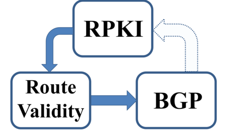

Our new RPKI Paper is Online:

>The RPKI is a new security infrastructure that relies on trusted authorities to prevent some of the most devastating attacks on interdomain routing. The threat model for the RPKI supposes that authorities are trusted and routing is under attack. Here we discuss the risks that arise when this threat model is flipped: when RPKI authorities are faulty, misconfigured,compromised, or compelled to behave like attackers. We show how design decisions that elegantly address the vulnerabilities in the original threat model have unexpected side effects in this flipped threat model. In particular, we show new
targeted attacks that allow RPKI authorities, under certain conditions, to limit access to IP prefixes, and discuss why even transient RPKI faults can take IP prefixes offline. Our results suggest promising directions for future research, and have implications on the design of security architectures that are appropriate for the untrusted and error-prone Internet.

Read the full paper here: [On Trusting Authorities: Weighing the Risks of the RPKI](http://www.cs.bu.edu/~goldbe/papers/hotRPKI_full.pdf). We will be presenting at HotNets-XII.