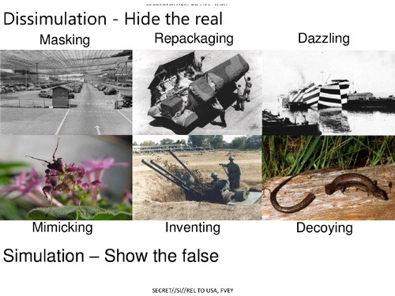
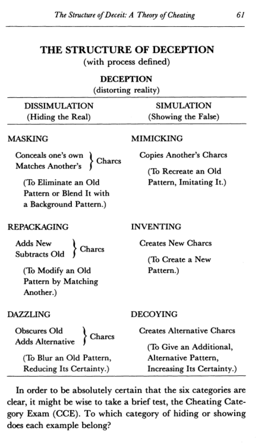
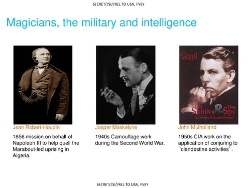

Looking over the Feb 24 2014 leak of the [GCHQ](http://en.wikipedia.org/wiki/Government_Communications_Headquarters) slide deck titled ['The Art of Deception: Training for a New Generation of Online Covert Operations'](http://leaksource.info/2014/02/25/gchq-jtrig-the-art-of-deception-training-for-a-new-generation-of-online-covert-operations/) I noticed some of the material was taken without credit from Bell[^3] and Whaley's 1982 book ['Cheating and Deception'](http://books.google.com/books?id=ojmwSoW8g7IC&lpg=PP1&dq=Cheating%20and%20Deception&pg=PP1#v=onepage&q=Cheating%20and%20Deception&f=false). 

For example compare GCHQ's slide 17: 

with page 61 from 'Cheating and Deception':

The terminology is exactly the same, the wording "Showing the False" has been copied verbatim from 'Cheating and Deception'. This isn't the only slide that was borrowed from Bell and Whaley. His terminology (called CHARCS in the book) appears on slide 24 as well. Furthermore the notion that stage magic provides a foundation for the study of deception is core to the book's approach[^4] and also shows up in the GCHQ's slides 8, 15, and 16 (shown below). Slide 17, posted above, comes next.

Clearly the author[^1] that prepared these slides was familiar with Bell and Whaley's book, but the slide deck never mentions the book by name although it cites other books. Slide decks rarely cite all their sources so this was probably not an intentional slight toward 'Cheating and Deception'. Nevertheless it is interesting to consider that British Intelligence is copy terminology and ideas verbatim from 'Cheating and Deception'[^2] but that during his life Bell lamented that his work on deception was being all but ignored by the intelligence community:

>The authors, especially and despite all, somehow continue to keep the faith and believe that out of sight over the horizon someone, someplace has a perceived need for work on deception [..]. In this, however, we may well be entering the analytically forbidden arena of self-deception.
- [J. Bowyer Bell](http://en.wikipedia.org/wiki/J._Bowyer_Bell)

[Bell](http://www.independent.co.uk/news/obituaries/j-bowyer-bell-37174.html) died in 2003 and [Barton Whaley died in 2013](http://www.legacy.com/obituaries/montereyherald/obituary.aspx?pid=166292561) just months before these slides became public. 

<a href="https://twitter.com/intent/tweet?screen_name=Ethan_Heilman" class="twitter-mention-button" data-related="Ethan_Heilman">Tweet to @Ethan_Heilman</a>

[^1]: According to the slide deck the author is the "Head of Human Science, NSTS"

[^2]: Bell's earlier work was on the IRA and it is what he is most known for, so it is possible that he is more widely read in British intelligence circles than US.

[^3]: Bell had quite the life, according to wikipedia:  "He was held hostage in Jordan, shot at in Lebanon, kidnapped in Yemen and deported from Kenya." when he wasn't painting or doing art history. - [http://en.wikipedia.org/wiki/J._Bowyer_Bell](http://en.wikipedia.org/wiki/J._Bowyer_Bell)

[^4]: It is no mistake that Barton Whaley was a magician. 

[^5]: I believe I am the first to notice this, as I can find no media reports linking the slides to 'Cheating and Deception' and it sadly is not a well known work. If anyone did write about this connection, contact me at Ethan.R.Heilman[at]gmail.com and I will happily credit you.