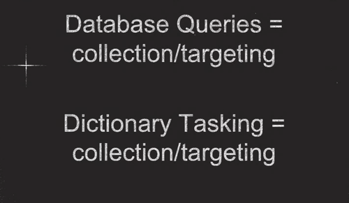

**Disclaimer:** I am not a lawyer, I do not have a security clearance, this is a ["best effort"](http://tools.ietf.org/html/rfc5290) investigation.
 
What does the NSA mean when they say COLLECTION[^5] or 'COLLECT it all'[^2]?
This in an important question because not only do representatives of the NSA make public statements about what they do and do not COLLECT, but   [Director of National Intelligence](http://en.wikipedia.org/wiki/Director_of_National_Intelligence) [James Clapper](http://en.wikipedia.org/wiki/James_R._Clapper), as well as other sources[^18], have stated that COLLECTION has a specific intelligence community meaning different from the common meaning.

>[..] there are honest differences on the semantics of what-- when someone says "collection" to me, that has a specific meaning, which may have a different meaning to him. - [Director of National Intelligence James Clapper](http://www.dni.gov/index.php/newsroom/speeches-and-interviews/195-speeches-interviews-2013/874-director-james-r-clapper-interview-with-andrea-mitchell)

More importantly, how the NSA interprets the word COLLECTION has  ramifications for what the NSA thinks the legal limits of surveillance are.

Below we will show that the US Intelligence Community and more specifically the  NSA's internal legal directives use a very narrow definition of COLLECTION which may allow them to skirt legal restrictions on the surveillance of US Persons.
Furthermore this NSA definition does not appear to be compatible with the use of the word COLLECTION in the documents which give the NSA the legal authority to engage in surveillance.  In fact the NSA's definition of COLLECTION, which we term 'COLLECTION as reporting' may create a [perverse incentive](http://en.wikipedia.org/wiki/Perverse_incentive) for the NSA to mass surveil US Persons rather than engage in targeted or limited surveillance.

Collection as interception:
============

Before we begin, lets consider the common standard usage of the term COLLECTION. 
For instance when people who are *uninitiated* into the vocabulary of the Intelligence Community ask "Should the NSA be allowed to COLLECT all American's emails?" what exactly are they asking?
They are asking should the NSA surveil, record and search all American's emails.  The word COLLECTION is being used mean an activity which includes the capturing, gathering, searching and acquisition of information. 
Under this definition all surveillance would count as COLLECTION, since surveillance by its very nature captures information.
We term this common usage definition 'COLLECTION as interception'.

Collection as targeting
================

The DoD dictionary provides the following definition:

>COLLECTION: (DOD) In intelligence usage, the acquisition of information and the provision of this information to processing elements. See also intelligence process. Source: JP 2-01 - [DoD dictionary](http://www.dtic.mil/doctrine/dod_dictionary/data/c/3149.html)

A more specific definition of COLLECTION is offered by 'The Operations Security INTELLIGENCE THREAT HANDBOOK' which defines COLLECTION as a step in [the intelligence cycle](http://en.wikipedia.org/wiki/Intelligence_cycle):

>Collection: includes both acquiring information and provisioning that information to processing and production elements. The collection process encompasses the management of various activities, including developing collection guidelines that ensure optimal use of available intelligence resources. Intelligence collection requirements are developed to meet the needs of potential consumers. Based upon identified intelligence, requirements collection activities are given specific taskings to collect information. - [Operations Security INTELLIGENCE THREAT HANDBOOK](http://fas.org/irp/nsa/ioss/threat96/part02.htm)

That is, COLLECTION is not a specific activity such as surveillance or interception, but rather a step in the intelligence cycle (see picture of intelligence cycle above).
COLLECTION is the step that transforms requirements into information via specific tasking/targeting.

The above slides, leaked by Snowden, from the [NSA's Cryptological School Course on Legal, Compliance, and Minimization Procedures](https://www.eff.org/document/minimization-procedure-slides), provides a more succinct definition: COLLECTION is targeting within the intelligence cycle[^8]. This definition given in the slide above agrees with the last part of INTELLIGENCE THREAT HANDBOOK's definition of COLLECTION.

To gain a more concrete picture consider the following example of COLLECTION transforming requirements into intelligence.

**Requirement:** Find out if Winston Smith truly loves big brother.
 
**Collection:** Find information through targeting and tasking.

1. searching databases 'who has Winston talked to for the last 2 years',
2. capturing information 'break into Winston's apartment and read his diary'.

In "searching a database" COLLECTION is happening without interception, since the information in the database existed prior to the requirement.
If COLLECTION means targeting and If such databases were built by capturing or intercepting information outside of the intelligence cycle, for example through mass surveillance, such interception may not be counted as a COLLECTION activity.
Under this definition the information is only COLLECTED when queries are run against it since COLLECTION only happens when someone or something is targeted to fulfill an intelligence requirement. We term this definition "COLLECTION as targeting'.

Collection as reporting
===========

Director of National Intelligence James Clapper's statements support the view when he says the mere interception of information is not COLLECTION, but he goes further to say that an activity only becomes COLLECTION when an analyst looks at it rather than when an analyst targets it[^7].

>And again, going back to my metaphor, what I was thinking of is looking at the Dewey Decimal numbers of those books in the metaphorical library. To me collection of U.S. Persons data would mean taking the books off the shelf, opening it up and reading it. - [Director of National Intelligence James Clapper](http://www.dni.gov/index.php/newsroom/speeches-and-interviews/195-speeches-interviews-2013/874-director-james-r-clapper-interview-with-andrea-mitchell)

Following Clapper's metaphor: if the NSA intercepts your email it is not COLLECTION. If the NSA then stores the intercepted email in a giant datacenter for 30 years, that is not COLLECTION. Even if the NSA processes[^9] and indexes your email it is not COLLECTION[^1]. It only would be COLLECTION if an analyst at the NSA reads your email in an intelligence report.

Clapper was likely basing this definition on the following DoD regulation:

>C2.2.1. Collection. Information shall be considered as "collected" only when it has been received for use by an employee of a DoD intelligence component in the course of his official duties. Thus, information volunteered to a DoD intelligence component by a cooperating source would be "collected" under this procedure when an employee of such component officially accepts, in some manner, such information for use within that component. Data acquired by electronic means is "collected" only when it has been processed into intelligible form. - [DoD Regulation 5240.1-R, Procedures Governing the Activities of DoD Intelligence Components that Affect United States Persons](https://www.aclu.org/files/assets/eo12333/DIA/DoD%20Regulation%205240.1-R,%20Procedures%20Governing%20the%20Activities%20of%20DoD%20Intelligence%20Components%20that%20Affect%20United%20States%20Persons.pdf)

The DIA HUMINT legal handbook attempts to provide further insight into this definition.

>So, we see that collection of information for DoD 5240.1-R purposes is more than "gathering" - it could be described
as "gathering, plus ... ". For the purposes of DoD 5240.1-R, "collection" is officially gathering or receiving information, plus an affirmative act in the direction of use or retention of that information. For example, information received from a cooperating source (e.g., the FBI) about a terrorist group is not "collected" unless and until that information is included in a report, entered into a data base, or used in some other manner which constitutes an
affirmative intent to use or retain that information. [..] What constitutes an intelligible form may be somewhat problematic.
-  [Intelligence Law Handbook: Defense HUMINT Service](https://www.aclu.org/files/assets/eo12333/DIA/Intelligence%20Law%20Handbook%20Defense%20HUMINT%20Service.pdf)

The handbook mentions an additional caveat, in defining retention[^17] with regard to COLLECTION:

 >'Once again, we must cautiously examine the vocabulary used in DoD 5240 .1-R. The term "retention" means more than merely retaining information in files - it is retention plus retrievability. As stated in DoD 5240.1-R --  "the term retention as used in this procedure, refers only to the maintenance of information about United States persons which can be retrieved by reference to the person's name or other identifying data."' [Intelligence Law Handbook: Defense HUMINT Service](https://www.aclu.org/files/assets/eo12333/DIA/Intelligence%20Law%20Handbook%20Defense%20HUMINT%20Service.pdf)

We call this, 'COLLECTION as reporting'[^15].

US laws on intelligence COLLECTION and surveillance:
======

Ignoring the 4th amendment[^16] of the US Constitution, lets examine three legal documents that restrict the surveillance powers of US intelligence and security organs.

**[Foreign Intelligence Surveillance Act or FISA](http://en.wikipedia.org/wiki/Foreign_Intelligence_Surveillance_Act)**, is a law which congress passed in 1978 as a reaction to widespread US Intelligence Community abuses[^10].
It was amended several times between 2006 to 2008 to remove some limits on the US Intelligence Community.
Since FISA doesn't use the word COLLECTION anywhere preferring the term 'electronic surveillance' we will skip it. A version of the [full text of FISA can be found here](http://www.gpo.gov/fdsys/pkg/STATUTE-92/pdf/STATUTE-92-Pg1783.pdf).

**[USA PATRIOT Act](http://en.wikipedia.org/wiki/Patriot_Act)**[^11], is a law that congress passed in 2001 in response to the 9-11 attacks against the US.
While uses the word COLLECTION once and COLLECTED several times it doesn't provide any indication that this word is being used in a sense other than 'to gather'.

**[Executive Order 12333 or EO 12333](http://www.archives.gov/federal-register/codification/executive-order/12333.html)**, is an [executive order](http://en.wikipedia.org/wiki/Executive_order) [issued in 1981 by President Reagan](http://en.wikipedia.org/wiki/Executive_Order_12333) and amended by President Bush twice in 2004 and 2008.

>(U) Executive Order 12333, as amended 2008, "United States Intelligence Activities," establishes the overall framework tor the conduct of intelligence activities by the Intelligence Community (IC), and specifies the scope of NSA/CSS' authorities to conduct its routine foreign intelligence mission; - [United States Signals Intelligence Directive USSID SP0019 - Oversight and Compliance Policy](https://www.aclu.org/files/assets/eo12333/NSA/United%20States%20Signals%20Intelligence%20Directive%20USSID%20SP0019.pdf)

While congress was not involved in the creation of EO 12333, laws such as the USA PATRIOT Act refer to it directly[^12] and executive orders have the power of law[^13]. [Full text of a version of EO 12333 can be found here](http://www.archives.gov/federal-register/codification/executive-order/12333.html).

>(U) NSA conducts the majority of its SIGINT activities solely pursuant to the authority provided by Executive Order (EO) 12333. - [Legal Fact Sheet: Executive Order 12333](https://www.aclu.org/files/assets/eo12333/NSA/Legal%20Fact%20Sheet%20Executive%20Order%2012333.pdf)

EO 12333 does not define COLLECTION but based on use within the document, COLLECTION can be taken to mean the capture of information. That is, it uses COLLECTION to mean the common definition, 'COLLECTION as interception'.
For example it lists physically where COLLECTION can happen. 

>Collection of national foreign intelligence, not otherwise obtainable, outside the United States shall be coordinated with the CIA, and such collection within the United States shall be coordinated with the FBI; - [Executive Order 12333](http://www.archives.gov/federal-register/codification/executive-order/12333.html#2.3)

If COLLECTION in EO 12333 meant targeting, then you could intercept, in an untargeted fashion, all data flowing through the US and then merely query it from a server outside the US. 
Such an action clearly goes against the intent of the order and would be an utterly pointless restriction to place on the Intelligence Community. 
It only makes sense if COLLECTION is being used in a broader sense than 'COLLECTION as targeting/reporting'

EO 12333 also lists what methods can be used to COLLECT, notice that none of the methods listed include search queries, but they do include "electronic surveillance, unconsented physical search, mail surveillance, physical surveillance, or monitoring devices": 
Clearly EO 12333 intends COLLECTION to mean surveillance and interception!

>"Collection Techniques. Agencies within the Intelligence Community shall use the least intrusive collection techniques feasible within the United States or directed against United States persons abroad. Agencies are not authorized to use such techniques as electronic surveillance, unconsented physical search, mail surveillance, physical surveillance, or monitoring devices unless they are in accordance with procedures established by the head of the agency concerned and approved by the Attorney General." - [Executive Order 12333](http://www.archives.gov/federal-register/codification/executive-order/12333.html#2.4)

Switching gears lets look at [United States Signals Intelligence Directive SP-00018 or USSID-18](http://www.dni.gov/files/documents/1118/CLEANEDFinal%20USSID%20SP0018.pdf).
USSID-18 is an internal policy directive derived from EO 12333 and its associated legal authority.
USSID-18 a guideline for how the NSA handles [SIGINT or Signals Intelligence](http://en.wikipedia.org/wiki/Signals_intelligence)[^4] programs that may involve a [US Person](http://en.wikipedia.org/wiki/United_States_person)'s communications.

>Derivative documents such as DoD Regulation 5240.1-R, NSA/CSS Policy 1-23, and USSID SP0018 establish policies and procedures consistent with Executive Order 12333. [OVSC1100 Overview of Signals Intelligence (SIGINT) Authorities](https://www.aclu.org/files/assets/eo12333/NSA/Overview%20of%20Signals%20Intelligence%20Authorities.pdf)

Both EO 12333 and USSID-18 use the term COLLECTION. USSID-18 explicitly defines COLLECTION as:

>3.4 (C xxx) Collection means intentional tasking and/or selection of identified nonpublic communications for subsequent processing aimed at reporting or retention as a file record. [USSID-18 80 Section 3: Definitions](http://cryptome.org/nsa-ussid18-80.htm#SECTION%203)

This definition suggestions that to COLLECT is to target (tasking or selection) and to report. That is, communications can be intercepted, stored and accessed, perhaps intentionally without being COLLECTED as long as they are not targeted/selected/tasked and reported.  

Worryingly USSID-18's definition of COLLECTION as reporting appears to be contrary to the use of COLLECTION as interception in EO 12333, despite USSID-18 being derived from the legal authority of EO 12333.
One possibility is that the US Intelligence Community may have redefined the word COLLECTION in USSID-18 to circumvent the limitations placed on it by EO 12333.

This interpretation of COLLECTION as targeting/reporting rather than interception within USSID-18 is buttressed by the following slide which answers the question what to do if an analyst see's information on a US Person. Notice the difference between 'inadvertent' and 'incidental'.

**Inadvertent** refers to tasking/querying which would be COLLECTION under USSID-18, it specifically says "stop COLLECTION". That is, your target is a US Person, but the analyst didn't know that at the time they engaged in the query against the data the NSA intercepted at some past point. Notice it doesn't say anything about the legality of how this data was originally intercepted.

**Incidental** is referring to the actual interception of information. The analyst is not targeting a US-Person but is getting a US Person's communications. Notice the slide says that this does not violate USSID-18 and you can continue intercepting this communication. This might not constitute COLLECTION of that US Person because it is not targeted at them.

For an activity to count as COLLECTION within USSID-18 must count as both targeted and reported.

[DoD regulation 5240.1-R](fas.org/irp/doddir/dod/d5240_1_r.pdf), mentioned in the section on 'COLLECTION as reporting', also derives its authority from EO 12333, and it also uses a definition 'COLLECTION as reporting' which appears to be incompatible with EO 12333.

Conclusion:
=====

To summarize, we come across three definitions of COLLECTION used in the law and intelligence community:

1. **'COLLECTION as interception'** - Information is COLLECTED when it is a taken/intercepted/recorded. Under this definition mass surveillance is COLLECTION.
2. **'COLLECTION as targeting'** - Information is COLLECTED when a targeted query or selector is used to fulfill an intelligence requirement. Under this definition mass surveillance is *not* COLLECTION.
3. **'COLLECTION as reporting'** - Information is COLLECTED when it is transformed into intelligence via targeting and tasking, placed in a report and read. Under this definition mass surveillance is *not* COLLECTION, even targeted surveillance would *not* be collection.

EO 12333, the legal authority upon which USSID-18 and 5240.1-R are based, uses definition 1, the broadest definition, COLLECTION as interception.
The NSA legal training slides, the INTELLIGENCE THREAT HANDBOOK and the DoD dictionary uses definition 2 (COLLECTION as targeting).
USSID-18, DoD Regulation 5240.1-R and DNI Clapper use definition 3. It is likely that this use of definition of 3 comes from the definition of COLLECTION within USSID-18, which contradicts the use of COLLECTION in EO 12333.

By defining collection narrowly in definition 2 or 3 the NSA potentially subverts the letter and spirit of EO 12333 allowing them to expand their surveillance powers[^3].
If communications or other information is captured without a target, say through bulk surveillance, then that information it is only COLLECTED when queries are run against it (see slide on Incidental collection).
This definition of COLLECTION puts far less restrictions on bulk surveillance than targeted surveillance and actually encourages the indiscriminate interception of US Person's communications, since if the NSA narrowed the scope of its interception, then that interception could become COLLECTION.
Furthermore, if targeted surveillance occurs but that surveillance doesn't end up in a report then it has not been COLLECTED giving them even more leeway[^14].

>It's a beautiful thing, the destruction of words. - 1984

As former NSA chief analyst John Schindler said:

>NSA has platoons of lawyers, and their entire job is figuring out how to stay within the law and maximize collection by exploiting every loophole. - [former NSA chief analyst John Schindler](https://www.eff.org/deeplinks/2014/07/former-state-department-executive-calls-executive-order-12333-legal-loophole)

or as the DIA legal handbook says:

>Too often we have unnecessarily restricted our efforts because we either too strictly interpret the rules applicable to special collection techniques [..] What is essential is that we in the DoD intelligence business permanently vest in ourselves a capable sophistication to make. maximum use of all authorized collection techniques. The rules of engagement by which we must operate are not hindrances - they are· keys to success - [Intelligence Law Handbook: Defense HUMINT Service](https://www.aclu.org/files/assets/eo12333/DIA/Intelligence%20Law%20Handbook%20Defense%20HUMINT%20Service.pdf).

**Update: Further reading** Just came across Dan Froomkin's piece on uncommon Intelligence Community definitions [NEW INTEL DOC: DO NOT BE ‘LED ASTRAY’ BY ‘COMMONLY UNDERSTOOD DEFINITIONS’ ](https://firstlook.org/theintercept/2014/09/29/new-intel-doc-led-astray-commonly-understood-definitions/). He links to several other sources which I'm including below:

[How to Decode the True Meaning of What NSA Officials Say](http://www.slate.com/articles/news_and_politics/politics/2013/07/nsa_lexicon_how_james_clapper_and_other_u_s_officials_mislead_the_american.html)

[A Guide to the Deceptions, Misinformation, and Word Games Officials Use to Mislead the Public About NSA Surveillance](https://www.eff.org/deeplinks/2013/08/guide-deceptions-word-games-obfuscations-officials-use-mislead-public-about-nsa)

[^1]: To use Clapper's metaphor this would be the same as assigning a book a Dewey decimal number .

[^2]: https://www.techdirt.com/articles/20140614/17181327584/nsa-can-neither-confirm-deny-it-uses-phrases-it-used-leaked-slide.shtml

[^3]: Although the NSA does have some rather powerful loopholes to exploit in EO 12333, see ['Loopholes for Circumventing the Constitution: Unrestrained Bulk Surveillance on Americans by Collecting Network Traffic Abroad'](http://papers.ssrn.com/sol3/papers.cfm?abstract_id=2460462) which talks about EO 12333 and the [NSA's MUSCULAR program](http://en.wikipedia.org/wiki/MUSCULAR_(surveillance_program)).

[^4]: That is, the capture, storage, processing and analysis of intercepted communications or signals.

[^5]: I'm capitalizing each instance of the word as to be clear that this is being used in a very specific sense.

[^6]: What follows are other examples in which EO 12333 clearly means COLLECTION as interception: 
1. "Those procedures shall permit collection, retention and dissemination of the following types of information" that is, the process is to collection, retain and disseminate or intercept, store and publish. 
2. "Agencies within the Intelligence Community shall use the least intrusive collection techniques feasible within the United States". 
3. "Groups for consideration of substantive intelligence matters will include representatives of organizations involved in the collection, processing and analysis of intelligence" and so on.

[^7]: It is possible that he is only talking about interception from bulk surveillance, since in that case no one is targeted by the surveillance.

[^8]: Of note in this slide, searching a database with a query is COLLECTION, but the target could be a subject rather than a person.
If the target is an subject, say nuclear weapons proliferation, but includes US Person's data then have you COLLECTED on that person?

[^9]: Typically the intelligence cycle goes requirements -> collection -> processing -> analysis ->... but if interception is not COLLECTION, then some elements of processing (such as decryption), may occurs before COLLECTION. This suggests a different cycle: requirements -> interception -> processing -> collection -> analysis ->...

[^10]: See [Church Committee](http://en.wikipedia.org/wiki/Church_Committee) which investigated abuses which included: [Project SHAMROCK](http://en.wikipedia.org/wiki/Project_SHAMROCK), [Project MINARET](http://en.wikipedia.org/wiki/Project_MINARET), [Operation Mockingbird](http://en.wikipedia.org/wiki/Operation_Mockingbird), and [COINTELPRO](http://en.wikipedia.org/wiki/COINTELPRO) among others.

[^11]: USA PATRIOT Act stands for: Uniting and Strengthening America by Providing Appropriate Tools Required to Intercept and Obstruct Terrorism Act of 2001, which probably qualifies at a top 10 of the most contrived acronyms.

[^12]: "An investigation conducted under this section shall— (A) be conducted under guidelines approved by the Attorney General under Executive Order 12333 (or a successor order);" - USA PATRIOT Act.

[^13]: How much power does the president wield with executive orders you might ask? Consider that the order which President Lincoln signed which freed Confederate slaves, [the Emancipation Proclamation](http://en.wikipedia.org/wiki/Emancipation_Proclamation), [was an executive Proclamation, which is an executive order intended for public consumption](https://www.princeton.edu/~achaney/tmve/wiki100k/docs/Emancipation_Proclamation.html), so was the [internment of Japanese Americans and other US Persons during the Second World War](http://en.wikipedia.org/wiki/Internment_of_Japanese_Americans), [EO9066](http://en.wikipedia.org/wiki/Executive_Order_9066) to  be exact.

[^14]: There is a danger here that we might see malicious actions where it is merely the incompetence of a massive bureaucracy that can't keep the meanings of its words straight. If this is mere accident, it happens to be a very advantageous accident for those wishing to expand the surveillance powers of the security services.

[^15]: An objection here might be that there is no difference between 'COLLECTION as targeting' and 'COLLECTION as reporting', but the reader should consider the case in which the NSA targets someone for COLLECTION doesn't find anything they can use and thus doesn't write a report. This would qualify as COLLECTION under 'COLLECTION as targeting' but it may not qualify as COLLECTION under 'COLLECTION as reporting'. This is a powerful loophole since it might allow the NSA to investigate people without any knowledge of them being guilty and then COLLECT on the person if they find evidence. For instance the ['Intelligence Law Handbook: Defense HUMINT Service'](https://www.aclu.org/files/assets/eo12333/DIA/Intelligence%20Law%20Handbook%20Defense%20HUMINT%20Service.pdf) says: 
>"Information held or forwarded to a supervisory authority, solely for the purpose of making a determination about its collectability (as described in DoD 5240.1-R, Procedure 1), and which has not been otherwise disseminated, is not "collected. "

[^16]: Since the intelligence community seems to pretend it doesn't exist we, with protest, ignore it as well. 

[^17]: One could write a blog entries on what they mean by retention and dissemination. 

[^18]: The [DIA](http://en.wikipedia.org/wiki/Defense_Intelligence_Agency) [HUMINT](http://en.wikipedia.org/wiki/Human_intelligence_(intelligence_collection)) legal handbook also warns the reader of the specific and special Intelligence Community's definitions of COLLECTION;
definitions that even disagree between the Army and [DoD](http://en.wikipedia.org/wiki/United_States_Department_of_Defense) documents.
>Procedure 2 introduces the reader of DoD 5240.1-R to his or her first entry into the "maze" of the regulation. To begin the journey, it is necessary to stop first and adjust your vocabulary. The terms and words used in DoD 5240.1-R have very specific meanings, and it is often the case that one can be led astray by relying on the generic or commonly understood definition of a particular word. For example, "collection of information" is
defined in the Dictionary of the United States Army Terms (AR 310-11 25) as: The process of gathering information for all available sources and agencies.  But, for the purposes of DoD 5240 .1-R,
information is "collected" [gives another definition -- see below for the continuation of this quote] - [Intelligence Law Handbook: Defense HUMINT Service](https://www.aclu.org/files/assets/eo12333/DIA/Intelligence%20Law%20Handbook%20Defense%20HUMINT%20Service.pdf)