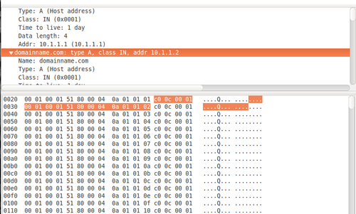

While creating a DNS zone file I begin to wonder how big I could make it before DNS would break. Could I map five hundred, ten thousand, one million IP addresses to a domain name? Is there a single number or would this number change depending on implementation details? It turns out there is, in fact, a single number, which across all standards compliment implementations is the maximum[^3] but that this number depends on the length of your domain name.

DNS queries.
====

To make a DNS query a client will send a UDP packet asking the DNS server for the IP addresses of a particular domain name.
If the response is 512 bytes or smaller, the server will just put the IP addresses in a UDP packet and send it back to the client[^1].
 
Otherwise, if the DNS response contains so many IP addresses that it can not fit in a single 512 byte UDP packet the server will send the client a UDP packet with the truncated flag set to tell the client that the response is too big and to retry over TCP.
The client on receiving end of a UDP packet with a truncated flag can open a TCP connection with the DNS server and continue the DNS query.

The maximum number of IP addresses.
====

4095 is the maximum possible number of IP addresses returned by a DNS query.
Lets look at why.
A large DNS response must fit into a single TCP packet.
TCP packets only reserve 2 bytes for the packet size. Thus, TCP packets can't hold more than $2^16=65536$ bytes[^2].
Since the domainname is included in the DNS response, the shorter the domainname the more room for IP addresses. Using the shortest valid domain name possible a.io (4 characters), there is a 13 byte overhead. Each IP address returned uses 16 bytes (as IPv4 is only 4 bytes this includes additional information), giving us the equation:

$$\mbox{size of response}=13+(16 \times \mbox{# IP addresses}) \mbox{ bytes}$$

Solving this for 65439 bytes gives us 4095 ip addresses.

**EDIT:** [Colmmacc on twitter](https://twitter.com/colmmacc) sent me [a correction](https://twitter.com/colmmacc/status/573386950218031104), initially I had said 4094 IP addresses, but it is actually 4095 IP address. I have fixed this in the post. Looking at ealier versions of my notes ([and tweets](https://twitter.com/Ethan_Heilman/status/507625759012179968)) I see that I had 4095 as well but must have accidently changed it at some point. [Colmmacc](https://twitter.com/colmmacc) also points out some very interesting methods to shorten the domain name to fit more IP addresseses but I haven't tried them yet see below:

<blockquote class="twitter-tweet" lang="en">
<a href="https://twitter.com/Ethan_Heilman">@Ethan_Heilman</a> also if you use "." as the domain, and avoid compressed labels, you can get to 5,956 A records in a single response. 12 + 11x
— Colm MacCárthaigh (@colmmacc) <a href="https://twitter.com/colmmacc/status/573388453909536769">March 5, 2015</a></blockquote>

[^1]: This is not strictly true. The DNS standards in RFCs allow DNS server to reply with UDP packets larger than 512 bytes, but often implementations use 512 as the cut off since older DNS standards set the cut off at 512 bytes. For instance [RFC-5966](http://tools.ietf.org/html/rfc5966) says: 'TCP [..] is often used for messages whose sizes exceed the DNS protocol's original 512-byte limit.'

[^2]: 65536 bytes is also the maximum packet size for UDP, so even if a DNS server was willing to deliver really large responses over UDP, you would face the same limit.

[^3]: Although your milage may vary. Bind, at least with the small amount of RAM I had, did not work well with very large zone files. Tests instead were conducted with a purpose built DNS server.