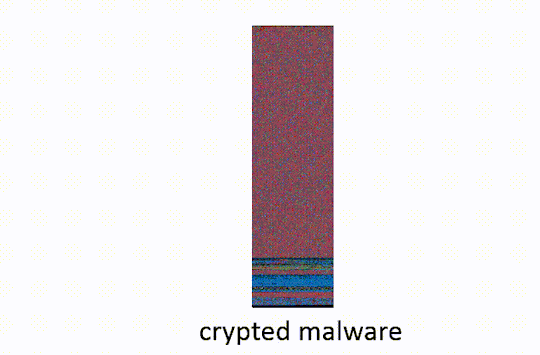
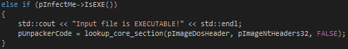
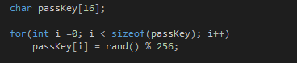
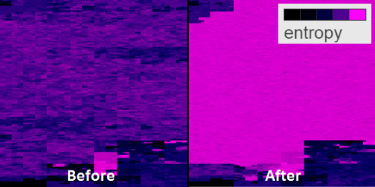
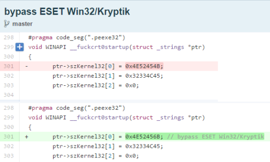
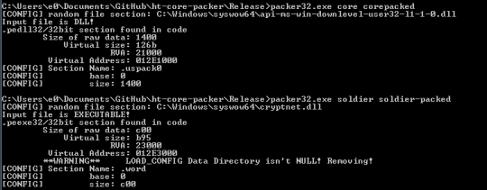

***Update:*** [Jos Wetzels just released an awesome blog post](http://samvartaka.github.io/malware/2015/09/13/hackingteam-crypter/) which analyzes weaknesses in core-packer's cryptography. Jos Wetzels uses these weaknesses to build [a proof-of-concept which defeats core-packer's protection](https://github.com/samvartaka/malware/blob/master/hackingteam_core_packer/core_packer_detect.py).

>It is EASY to bypass commonplace protection systems such as antivirus systems - [David Vincenzetti, CEO of Hacking Team](https://wikileaks.org/hackingteam/emails/emailid/1142540)[^11]

In this blog entry we investigate how Italian malware vendor [Hacking Team](https://en.wikipedia.org/wiki/Hacking_Team) obfuscated their malware, specifically the custom software they developed for
this task called core-packer[^13]. This analysis was a joint project between [Will Cummings](https://twitter.com/dubbelyew) and [Ethan Heilman](https://twitter.com/Ethan_Heilman).

In July 2015 [Hacking Team’s source code and internal documents were leaked online](http://www.ibtimes.co.uk/hacking-team-hacked-spy-tools-sold-oppressive-regimes-sudan-bahrain-kazakhstan-1509460) by [Phineas Fisher](https://twitter.com/GammaGroupPR)[^2] after compromising their network. When source code from the leak [was posted to github](https://github.com/hackedteam) we decided to exercise our curiosity about the techniques they used to obfuscate their malware. The Hacking Team leak provides a rare and topical view[^1] into the world of malware vendors catering to repressive governments[^5].

## What are Packers and Crypters?

Packers and crypters are tools which [alter malware to frustrate signature based Anti-Virus detection and  analysis](https://blog.malwarebytes.org/intelligence/2013/03/obfuscation-malwares-best-friend/). They are a crude form of software camouflage.

_Packer_ refers to the fact that a packer uses compression to "pack" an executable into a smaller size. Sometimes this is used solely to reduce file size, but for malware this packing serves a second purpose of making the malware harder to detect and analyze[^18]. _Crypters_ provide a similar anti-analysis function but use encryption instead of compression. Both Crypters and packers wrap the malware so that when it is run, it is unpacked or decrypted[^3]. This behavior is similar to how a [self extracting zip](https://en.wikipedia.org/wiki/Self-extracting_archive) file works, except that this de-obfuscation process happens only in memory, whereas self-extracting zips write the uncompressed contents to disk.

To de-obfuscate the malware once it is run, a stub is added to the obfuscated program. _The stub_ contains all the necessary instructions and cryptographic keys to unpack or decrypt the obfuscated program. When an obfuscated program is run, the stub is run first. Once the stub finishes unpacking/decrypting the malware, the stub passes control to the now de-obfuscated program. The stub is often looks innocent since it only performs a single task.

In the graphic below, we show how a crypter can be used to bypass an Anti-Virus scan for malware.

The idea behind both of these techniques (packing/crypting) is to make it difficult for anti-malware tools to inspect the obfuscated program without running it. Modern Anti-Virus (AV) will attempt to automatically unpack malware, emulating its execution until the malicious payload is revealed and can be scanned. Crypters can include methods to bypass this, some more sophisticated than others: some authors will simply delay decryption of the payload long enough that it becomes impractical for the AV to perform this type of dynamic analysis[^15].

## What is core-packer?

Core-packer is a crypter developed by Hacking Team (while core-packer bares the name “packer” it is in fact a crypter[^6]). Core-packer can be compiled to both a 32-bit and 64-bit [windows executable](https://en.wikipedia.org/wiki/Portable_Executable). The behavior of the 32-bit and 64-bit versions differs, the 32-bit version obfuscates executables, whereas the 64-bit version is only capable of handling DLLs.

## Core-packer in Four Steps:

The target exe, is the malware which the packer is obfuscating. The [core-packer source has been posted to github](https://github.com/hackedteam/core-packer). We will be linking to relevant lines of code. Our analysis focuses on the 32-bit core-packer crypting an executable, some of the steps are different under other configurations (64bit, DLLs). The last commit to core-packer was Sept. 2013, so they may have phased it out in favor of off the shelf solutions[^17].

**Step One: Stub Extraction.**
Core-packer has the stub compiled into itself. Upon being run core-packer [searches through its process memory to find the stub](https://github.com/hackedteam/core-packer/blob/master/core-packer/main32.cpp#L638) (named pUnpackerCode in the source code). It identifies the stub code using one of four section names depending on configuration: peexe32, peexe64, pedll32, pedll64.

Once it finds the stub it extracts it so that it can perform step two.

**Step Two: Stub Injection.**

Core-packer loads the target exe into memory and [injects the stub into the target exe](https://github.com/hackedteam/core-packer/blob/master/core-packer/main32.cpp#L976).

**Step Three: Encrypt Target Exe’s Data and Executable Sections.**

Core-packer [computes a random encryption key](https://github.com/hackedteam/core-packer/blob/master/core-packer/main32.cpp#L687). It then uses this key to [encrypt all the executable and .text sections](https://github.com/hackedteam/core-packer/blob/master/core-packer/main32.cpp#L793) inside the target exe (making sure not to encrypt the stub)[^14]. The packer uses the TEA cipher if the target is an exe, or RC4[^8] if it is a DLL. It later saves this key into the stub so the stub can reverse the encryption.

Using [binvis.io](http://binvis.io) we visualize before and after entropy levels of the malware (shown below). The encrypted sections have a high level of entropy and appear as bright purple.

**Step Four: XOR-Encrypt the Decryption Code in the Stub.**

Encryption code inside of an executable can be a sign that it has been crypted which in turn is suspicious. To obfuscate the decryption code, core-packer [encrypts the TEA decryption code inside the stub by  xoring all the bytes with 0x66](https://github.com/hackedteam/core-packer/blob/master/core-packer/main32.cpp#L981)[^4].  

## Additional Obfuscation Techniques:

Another common technique seen in core-packer is the use of GetProcAddress to obscure function imports. GetProcAddress is a Win32 API call which given a module and a function name will return the address of the named function. By using GetProcAddress to “import” suspicious functions such as VirtualProtect, malware authors can break detections. The string literals used to look up these functions can be easily signatured, forcing the author to add another level of obfuscation, for example polymorphic string encryption. Hacking Team went down a less sophisticated path: in one case, core-packer emits a number of ASCII strings into the code section and uses a bespoke function to retrieve them. The core-packer code includes numerous instances of commented-out GetProcAddress calls with type defs for function pointer to Win32 calls.That many of these lines are commented out is an indication that they may have moved away from this technique.

## How was Core-Packer used to Bypass Anti-Virus Detection?

Core-packer's first commit is Oct 2012, nine days after Citizen Lab released a report [“Backdoors are Forever: Hacking Team and the Targeting of Dissent?”](https://citizenlab.org/2012/10/backdoors-are-forever-hacking-team-and-the-targeting-of-dissent/) on Hacking Team’s malware. It seems likely that core-packer was developed to prevent future disclosures by increasing the stealth of Hacking Team’s malware. In fact in response to the Citizen Lab they wrote talking points to assure their clients that malware was safe to use. One of these talking points was that they were implementing "technical measures", perhaps referring to core-packer.

>[..]next release will introduce technical measures to lessen the chances of such a scenario happening again - [Re: news](https://wikileaks.org/hackingteam/emails/emailid/448504)[^16]

Looking through the leaked emails we see several discussions[^9] of Hacking Team’s malware being discovered by Anti-Virus and taking actions to evade this detection. For the sake of brevity, we will look at one one example.

On April 24, 2013 Hacking Team malware support received the following email:

>Good morning, in invisibility report for version 8.3 is ESET Smart Security reported as antivirus where RCS is working. But, today customer tryied to install it on computer with ESET and installed agent was detected by this anitivirus. [..] Will there will be available some fix for ESET software? - [Subject: IUQ-855-32679: ESET Smart Security: Invisibility broken, To: rcs-support@hackingteam.com](https://wikileaks.org/hackingteam/emails/emailid/688586)[^10]

April 29th 2013 a member of Hacking Team [changed a pointer in core-packer with the commit message “bypass ESET Win32/Kryptik”](https://github.com/hackedteam/core-packer/commit/cfb536420de8edb1020e86e9852a815aa7e32ea7)(as shown above). It appears the intention of this change was to break the signature that [ESET](https://en.wikipedia.org/wiki/ESET) Anti-Virus scanner was using to detect the malware. Win32/Kryptik refers to a codename given to Hacking Team’s malware by Anti-Virus vendors.

May 2, 2013 another change was made to core-packer to alter the way in which the string ‘VirtualProtectAlloc’ is called, this change had the commit message ["patch in DllEntryPoint to bypass ESET Win32/Kryptik. ??"](https://github.com/hackedteam/core-packer/commit/25f0cab76cc4106b88e8000237b0bf6d006762b9).

On May 10, 2013 the Hacking Team support ticket tracking the ESET detection is updated to read:

>Hiding enhancements for ESET was introduced in new installed release 8.3.3. I hope, problem is solved. - [IUQ-855-32679: ESET Smart Security: Invisibility broken](https://wikileaks.org/hackingteam/emails/emailid/711283)

Soon after the support ticket was marked  [closed](https://wikileaks.org/hackingteam/emails/emailid/681156), evidently because the issue was resolved.

## Conclusion:

We have provided a brief sketch of Hacking Team's core-packer and some[^19] of the techniques used. We also took a brief look at one episode in the cat and mouse game between malware vendors and Anti-Virus vendors. The Hacking Team leak suggests that while the current detect and flag strategy employed by Anti-Virus can be a nuisance to malware vendors, malware ultimately has the upper hand. This is not to say that Anti-Virus vendors could not adopt more effective strategies, we believe in fact that more effective strategies exist, but that the status-quo favors malware.

In our next blog entry we will use the Hacking Team files to develop a simple game modeling the AV and Malware dynamic and look at alternative strategies.

## Other Resources on Hacking Team:

1. [Citizen Lab's work on Hacking Team](https://citizenlab.org/tag/hacking-team/)

2. [HACKING TEAM: A ZERO-DAY MARKET CASE STUDY](https://tsyrklevich.net/2015/07/22/hacking-team-0day-market/)

3. [4armed](http://www.4armed.com) has an excellent series of articles: [HACKING TEAM’S KILLSWITCH – DISABLING THE GALILEO RCS REMOTELY AND SILENTLY](https://www.4armed.com/blog/hacking-teams-killswitch-disabling-galileo-rcs-remotely-silently/), [HACKING TEAM’S GALILEO RCS – REPURPOSING ESPIONAGE SOFTWARE](https://www.4armed.com/blog/hacking-teams-galileo-rcs-repurposing-espionage-software/), [HACKING TEAM RCS ANALYSIS](https://www.4armed.com/blog/hacking-team-rcs-analysis-hacked-team/),[GALILEO RCS – RUNNING AN ESPIONAGE OPERATION](https://www.4armed.com/blog/galileo-rcs-running-espionage-operation/), [and a few others](https://www.4armed.com/blog/category/hacking/).

4. Gutting Hacking Team - 2012, [translated into English by Hacking Team](https://wikileaks.org/hackingteam/emails/emailid/477437) or in [Russian here](http://issuu.com/rootaxe/docs/xakep_02_2012) (page 66).

Much of our analysis was performed by staring at the source code. In light of this, if you discover any errors or details you would like to see included please let us know at [@Ethan_Heilman](https://twitter.com/Ethan_Heilman) and we will give credit for the correction or addition.

## Appendix

**How to build and run core-packer:**
After some work we were able to build and run core-packer. Based on the project files left by the authors, we found that core-packer was built with Visual Studio 2010. We were unable to get a freeware copy of Visual Studio 2010 but 2012 worked. The project will not compile on later versions of Visual Studio without some trivial code modifications.

Testing the packer on random exe’s and DLLs caused the packer to crash, but when run against binaries compiled by Hacking Team (available at DUMP_ROOT/rcs-dev%5Cshare/HOME/Ivan/full_themida_core/windows/), such as their scout or soldier malware, core-packer ran without issue. Note that the 64-bit version of core-packer appears to only work on DLLs and not exes. All our tests were performed against the 32-bit version of core-packer.

See image below:

**Core-Packer May Have Violated the GPL**
[Core-packer uses source code](https://github.com/hackedteam/core-packer/blob/master/core-packer/distorm/config.h) from [the distorm project](https://github.com/gdabah/distorm) licensed under the [Gnu Public License](https://en.wikipedia.org/wiki/GNU_General_Public_License) or GPL[^7]. The GPL requires that if a software project includes GPL software, that project must distribute the source code when they distribute the compiled software. Thus, by infecting someone with malware protected by core-packer without also including the source, they may have violated the GPL. It is possible thatt when their source code was  posted to github they became GPL compliant[^12].

[^1]: Timing of the leak and the debate over the [US Commerce Dept’s implementation](https://www.federalregister.gov/articles/2015/05/20/2015-11642/wassenaar-arrangement-2013-plenary-agreements-implementation-intrusion-and-surveillance-items) of rules governing dual use technologies (include computer surveillance technologies) under the [Wassenaar Arrangement](https://en.wikipedia.org/wiki/Wassenaar_Arrangement) is highly suspicious.

[^2]: The evidence that Phineas Fisher was behind the attack and subsequent data dump is based on a journalist Lorenzo Franceschi-Bicchierai’s statement [that the person controlling Hacking Team's compromised twitter account told him that they were also the person controlling Phineas Fisher’s twitter account and proved this by tweeting from the Phineas Fisher account](http://motherboard.vice.com/read/hacker-claims-responsibility-for-the-hit-on-hacking-team). While it is the most credible narrative at this point, we do not have enough evidence to rule out other possibilities.

[^3]: When referring to packers/crypters we are only talking about
[runtime packers/crypters](https://www.virusbtn.com/resources/glossary/packer.xml) (that is crypters that decrypt the malware in memory when the malware is run).

[^4]: Now you can laugh at all the people that said that the xor encryption brute forcer you wrote was useless.

[^5]: Citizen Lab did an excellent job analyzing the human consequences of Hacking Team’s involvement with repressive governments in their paper [“When Governments Hack Opponents: A Look at Actors and Technology”](https://www.usenix.org/system/files/conference/usenixsecurity14/sec14-paper-marczak.pdf)

[^6]: "Packer" is often colloquially used to refer to both crypters and packers. We are being somewhat pedantic here in our use of exact terminology, but the security community could use more pedantry in its use of vocabulary.

[^7]: Distorm does offer a commercial license which can be purchased as an alternative to the GPL, but we contacted distorm and they confirmed that they did not sell Hacking Team a commercial license. This is supported by the fact that the GPL license is in the source code included in core-packer and that there is no record of distorm being paid or contacted in the Hacking Team emails.

[^8]: You may be temped to crack a joke about using RC4 [in this day and age](https://en.wikipedia.org/wiki/RC4#Security), but in this setting RC4 makes sense. You need a simple, well used, efficient stream cipher. Cryptanalytic strength isn’t particularly important when you are saving the key along with the ciphertext. It just needs to be slightly harder to break than the work necessary to extract the key from the binary.

[^9]: Anyone wanting to dive deeper need only search for Virus-Total emails in the Hacking Team leak. Its a fascinating adventure into perspectives on the malware side of Anti-Virus detection.

[^10]: “Good morning, in invisibility report for version 8.3 is ESET Smart Security reported as antivirus where RCS is working. But, today customer tryied to install it on computer with ESET and installed agent was detected by this anitivirus. Please, see attached screenshots. Please let us what to do, customer must stop to work with ESET? Will there will be available some fix for ESET software? Thank you,” [IUQ-855-32679: ESET Smart Security: Invisibility broken](https://wikileaks.org/hackingteam/emails/emailid/677811)

[^11]: “Please TRUST me: #1. It is  EASY to bypass commonplace protection systems such as antivirus systems or personal, network IPS aka Intrusion Prevention Systems aka modern firewalls.  #2. “New generation” / “Behavioral” / “In the cloud” systems can be EASILY bypassed AS WELL.  #3. “Application isolation” technologies (e.g., sandboxes) WORK, but UP TO A POINT. Many thanks to Alberto Ornaghi alor. - [Confidence in antivirus falls to all-time low](https://wikileaks.org/hackingteam/emails/emailid/1142540)

[^12] :Crypters and packers raise interesting legal questions about licenses because on one hand they are like compilers but on the other hand they inject some of their own code into the packed executable.

[^13]: Core-packer was one of many pieces of software that Hacking Team used, including [several commercial off the shelf packers](https://wikileaks.org/hackingteam/emails/emailid/495832) including [vmprotect](http://vmpsoft.com/support/faq/) and [themida](http://www.oreans.com/themida.php) and developed several pieces of software, called [melters](https://github.com/hackedteam/libmelter), which would disguise their malware by merging it with harmless programs.

[^14]: A side by side comparison of the bytes of malware crypted by core-packer. On the left we have the malware prior to being crypted, on the right the malware after it has been crypted.

[^15]: It appears that core-packer uses this technique see [DELAYDECRYPT function and associated assembly](https://github.com/hackedteam/core-packer/blob/88a2ee1b9e85b410abf225ae609e30c34d7c99a6/core-packer/DllEntryPoint32.cpp#L816), we did not investigate this functionality.

[^16]: "I believe that they are asking for feedback on how we are going to face the problem on a technical viewpoint: Simon and the clients already know that we sell only to govt. agencies. Replying in a too generic way will only upset them.  I think we can use the same approach used for the August issue on that side:  - issue related to an old version - we are already safe, but we are proactive and next release will introduce technical measures to lessen the chances of such a scenario happening again - we are active in raising the client's awareness to such issues, to make the whole intelligence community that work with us operate in a safer way - they can operate safely, right now!  No specific technical detail tough, we are not going to disclose the specific measures." - [Re: news](https://wikileaks.org/hackingteam/emails/emailid/448504)

[^17]: In 2014 they discussed [acquiring and testing additional packers](https://wikileaks.org/hackingteam/emails/emailid/1714).

[^18]: [UPX](http://linux.die.net/man/1/upx) being one of the more famous packers.

[^19]: Our analysis was by no means complete.