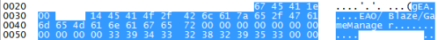
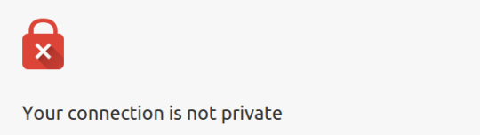
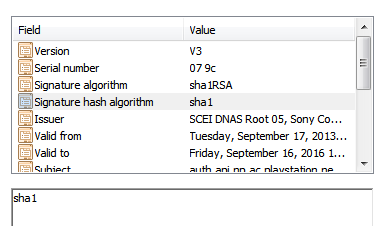
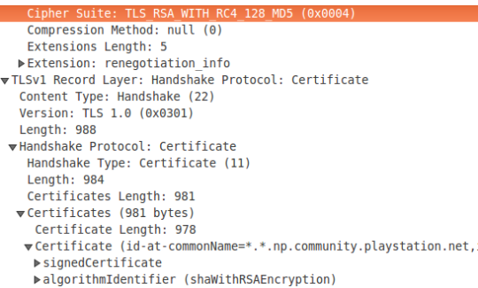

There has been much speculation in the media about PlayStation 4 (PS4) game consoles being used in the recent Paris terrorist attacks. However there is no evidence a PlayStation 4 (PS4) was connected to the Paris attacks. Most of the media accounts quoted a Belgian Minister Jan Jambon, who made claims, days prior to the attacks, that communication via a PS4 was "the most difficult" for intelligence agencies to decrypt and track. In this blog entry I  examine the Belgian Minister's statements, analyze the secrecy and anonymity provided by Sony's PS4 to conclude that I was unable to find any evidence supporting Minister Jambon remarks. 

How it started:
========

Soon after the terrorist attacks on Paris, [Paul Tassi](https://twitter.com/PaulTassi), a journalist at Forbes magazine, wrote:

>"Following Friday night’s terrorist attacks in Paris[..], authorities are discovering just how the massacre was planned. And it may involve the most popular gaming console in the world, Sony’s PlayStation 4. [..] Evidence reportedly turned up included at least one PlayStation 4 console. Belgian federal home affairs minister Jan Jambon said outright that the PS4 is used by ISIS agents to communicate, and was selected due to the fact that it’s notoriously hard to monitor." - [How Paris ISIS Terrorists May Have Used PlayStation 4 To Discuss And Plan Attacks](https://web.archive.org/web/20151115173247/http://www.forbes.com/sites/insertcoin/2015/11/14/why-the-paris-isis-terrorists-used-ps4-to-plan-attacks/) 

A day later Tassi was forced to post a correction[^4] stating that there was no evidence of a PlayStation 4 (PS4) found in any of the raids and that Jan Jambon's comments about terrorists using PS4s to communicate were made days prior to the attacks and were unrelated to the attacks. 
Tassi said that he "misread the minister’s statement"[^3]. His misreading had serious repercussions, the Chair of the FCC Tom Wheeler used the incorrect Tassi story to argue for new spying laws[^5].
Paul Tassi's reporting was based on two quotes by Minister Jan Jambon, a Flemish politician appointed last year to the office of ['the Vice-Premier and Minister of Security and Home Affairs, in charge of State Buildings'](http://jambon.belgium.be/en/biography).
The first quote comes from an interview[^12] conducted by [Matthew Kaminsk](https://twitter.com/KaminskiMK):

>*Jan Jambon:* "I heard that the most difficult communication between these terrorists is the PlayStation 4. "

>*Matthew Kaminsk:* "Really?"

>*Jan Jambon:* "Yeah, yeah, it is very very difficult for our services, not only our services, Belgian services, all the international services, to decrypt the communication that's done via PlayStation 4"

>*Matthew Kaminsk:* "Have you cracked WhatsApp?"

>*Jan Jambon:* "WhatsApp is also a difficult one, but there we could, not we not me, but the services could decrypt WhatsApp, but PlayStation 4 should be very difficult. Its a challenge."

The second quote first appeared in the Belgian publication ['the Bulletin'](www.xpats.com/brussels-weakest-link-europes-fight-against-terrorism) and is reportedly from the same interview with Matthew Kaminsk[^13].

>"PlayStation 4 is even more difficult to keep track of than WhatsApp"- Jan Jambon 

Since very little is known about the Paris attacks or how the terrorists communicated I will avoid speculating on that.  Instead I want to investigate the two quotes made by Jambon. First, does the PS4 encrypt communication in such a way that it is "the most difficult" to decrypt when compared with other communication services? Second, is the PS4 " more difficult to track than WhatsApp"?

How Good is the PS4 at Encrypting Network Traffic?
===========

To answer this question, I examined a recording of the network traffic sent and received by a PS4 running the game [Dragon Age Inquisition](https://en.wikipedia.org/wiki/Dragon_Age:_Inquisition). 
The communication can be broken into two groups: (1). communication between the PS4 and the PlayStation Network (PSN) and (2). communication between the PS4 and other parties.
I will first look at PS4 to PlayStation Network (PSN) communication and then briefly describe the communication between other parties.

The PlayStation Network (PSN) is a social networking and identity service offered by Sony. 
According to Sony's documentation a PS4 user must register and sign into the PlayStation Network (PSN) before playing online games[^7].
Much of the communication functionality offered by the PS4 is provided by the PSN. 
I found that while [a small amount of the PS4-PSN communication](http://www.psdevwiki.com/ps4/Online_Connections) was in the clear (unencrypted), much of it was protected by [TLS](https://en.wikipedia.org/wiki/Transport_Layer_Security). 
TLS is the same encryption technology that protects [HTTPS](https://en.wikipedia.org/wiki/HTTPS) websites for instance twitter, reddit or wikipedia are protected by TLS.
In TLS a client performs a protocol with the server to establish an encrypted connection by agreeing on a shared encryption key and cipher.

Like many technologies TLS can offer different levels of protection, from totally broken to very secure, depending on the version used and how it is configured.
Interestingly, the PS4 was running multiple TLS clients with different versions and configurations and on the server side PSN was also running multiple versions and configurations of TLS.
The more configurations you run the more likely that one of them will be broken.
The versions of TLS used in the PS4 range from the very old TLS-1.0 (developed 16 years ago in 1999) to the most recent TLS-1.2[^18] (developed in 2008).

Many of the TLS configurations I observed were insecure and provided only weak security.
Some of the certificates sent by the PSN TLS servers used the insecure signature algorithms 'SHA1withRSA'. 
NIST depreciated it in 2011 and stated that "it shall not be used after 2013"[^8].
Google chrome marks certificates signed with 'SHA1withRSA' as ["affirmatively insecure"](http://blog.chromium.org/2014/09/gradually-sunsetting-sha-1.html).

Even worse, many of the PS4 clients and the PSN servers included the insecure RC4 cipher in their cipher suites[^14]. 
[Microsoft recommends completely disabling and disallowing RC4 on all systems](http://blogs.technet.com/b/srd/archive/2013/11/12/security-advisory-2868725-recommendation-to-disable-rc4.aspx) and 
RC4 is so dangerous to use that the standards body of the internet, the IETF, wrote an RFC with the titled *["Prohibiting RC4 Cipher Suites"](https://tools.ietf.org/html/rfc7465)*, the RFC states:

1. "TLS clients *MUST NOT* include RC4 cipher suites in the ClientHello message."
2. "TLS servers *MUST NOT* select an RC4 cipher suite when a TLS client sends such a cipher suite in the ClientHello message."
3. "If the TLS client only offers RC4 cipher suites, the TLS server MUST terminate the handshake.  The TLS server MAY send the insufficient_security fatal alert in this case."

It gets worse, because not only do some of the PS4 TLS clients include RC4 in their cipher suites, but fatally the PSN server actually uses RC4 for TLS connections (see image below).
This is particular dangerous because RC4 is considered cryptographically broken. If an encrypted TLS connection uses a broken cipher an adversary might be able to decrypt the messages.
For instance researchers had performed practical plaintext recovery attacks[^9][^10] against TLS when using RC4. 

The above is not a complete list of all the cryptographic sins of PS4-PSN communication, but it is sufficient to show that not only is PSN significantly more vulnerable cryptographically than other standard communication platforms such as twitter, reddit, or wikipedia[^17] but it fails to meet the bare minimum industry best practices[^11].

Lets pretend for a moment that Sony deployed stronger encryption, would PS4-PSN communications be difficult for intelligence agencies to decrypt? No, let me explain why. TLS allows two parties to communicate privately but in this case one of those parties is PSN i.e. Sony. This means it is very likely that intelligence agencies only have to ask for Sony's encryption keys to decrypt PSN traffic. Sony even says they will share PSN activity (messages, voice, videos, etc..) with appropriate authorities in their Terms of Use[^15]:

>Are we monitoring PSN? Yes but we can't monitor all PSN activity [..]. However, we reserve the right [..] to monitor and record any or all of your PSN activity [..]. Your use of PSN and our community features may be recorded and collected by us [..]. Any information collected in this way, for example, your UGM, the content of your voice and text communications, video of your gameplay, the time and location of your activities, and your name, your PSN Online ID and IP address, may be used by us or our affiliated companies to enforce these Terms and the SEN Terms of Service, to comply with the law, [..]. This information may be passed to the police or other appropriate authorities." - PlayStation Software Usage Terms[^2]

Now I will briefly look at communication between the PS4 and other parties.
The PS4, once signed into PSN (PlayStation Network), allows the user to connect to other servers and parties outside the PSN.
Much of the network traffic I looked at was UDP traffic from the PS4 to other home internet users.
Most of these UDP packets had very high entropy suggesting that they were encrypted or compressed. 
If these packets are Dragon Age Inquisition game actions, then it is likely they were using [the same network protocol used by PC version](https://www.youtube.com/watch?v=FxJeZCHmdHg).
These packets may also have been the VOIP (Voice Over IP) service offered by PSN to allow gamers to talk to each other.
Given that user identity and credentials are managed by PSN, it seems plausible that a compromise of PS4-PSN encryption would also allow the decryption of VOIP communications.

Is the PS4 harder to track than WhatsApp?
===========

Both WhatsApp and the PS4 limit anonymity out of the box by requiring that users associate their online identity with a real world identifier.
When a user connects a PS4 to the PlayStation Network (PSN), the service learns the unique identifier of their PS4.

>"SCE will also be able to know your console unique ID and your console IP address which is automatically assigned to your PS4 system by your internet service provider when you connect your PS4 system to the internet." - [PLAYSTATION4 SYSTEM SOFTWARE LICENSE AGREEMENT (Version 1.1)](http://www.scei.co.jp/ps4-eula/ps4_eula_en.html)

Not only that but most multiplayer PS4 games require a PlayStation Plus account. Reading Sony's documentation it seems that to registering a PlayStation Plus account you must supply credit card and billing records. I don't own a PS4, so I have not verified this myself.

>"In almost all cases, a PlayStation Plus account is needed to play online multiplayer on the PS4." - [PS4 Online Multiplayer Requirements](https://support.us.playstation.com/articles/en_US/KC_Article/PS4-Online-Multiplayer-Requirements/?)

Similarly, WhatsApp requires that you associate your phone number with your WhatsApp username. 
In both services this registered information is then used to track and identify users.
Thus, neither one is designed, nor appears to offer, any particular problems from a tracking perspective[^1].

Additionally, neither provides anywhere near the level of communications secrecy as created by secure messaging apps.
All the messages sent by the [WhatsApp client can be decrypted by the WhatApp server](https://www.eff.org/secure-messaging-scorecard), and as we discussed earlier, since PSN/Sony manages user identities and credentials the same weakness likely exists for the PS4.

For further reading I recommend, ["Forensic analysis of a Sony PlayStation 4: A first look"](http://www.sciencedirect.com/science/article/pii/S1742287615000146) which shows how police can access files and data from a PS4 and that the PSN records and stores user activity on their servers (even if a PS4 was destroyed the data might still be accessible by Sony).

Conclusion:
===========

I was not able to confirm any cryptographic benefit to using the PS4 over other standard communication tools such as gmail, facebook or twitter, nor does Sony promise the PS4 deliverers this functionality. In fact many things in their documentation suggest the opposite.
Furthermore, the PS4 often requires that users give over information which could identify their real names to even begin using it making it very easy to track.
This is not to say I am contradicting Minister Jambon statements[^16], but in my brief investigation I was not able to find any evidence to support his statements.

[^1]: Granted a user could buy their PS4 or mobile phone with cash but these are additional steps that users of other services don't need to take. Any communication technology can be made private given massive amounts of effort. I could imagine someone using a mobile phone as a WhatsApp [burner](https://en.wikipedia.org/wiki/Prepaid_mobile_phone#Privacy_rights_and_prepaid_mobile_phones), but a PS4 burner gets expensive quick.

[^2]: "14. Are we monitoring PSN? 14.1. Yes but we can't monitor all PSN activity and we make no commitment to do so. However, we reserve the right in our sole discretion to monitor and record any or all of your PSN activity and to remove any of your UGM at our sole discretion, without further notice to you. Your use of PSN and our community features may be recorded and collected by us or sent to us by other users as described in 13.1. Any information collected in this way, for example, your UGM, the content of your voice and text communications, video of your gameplay, the time and location of your activities, and your name, your PSN Online ID and IP address, may be used by us or our affiliated companies to enforce these Terms and the SEN Terms of Service, to comply with the law, to protect our rights and those of our licensors and users, and to protect the personal safety of our employees and users. This information may be passed to the police or other appropriate authorities. By accepting these Software Usage Terms, you expressly consent to this."- [Playstation: Software Usage Terms] (https://www.playstation.com/en-in/legal/software-usage-terms/)

[^3]: "'This was actually a mistake that I’ve had to edit and correct,' writer Paul Tassi told me this afternoon. 'I misread the minister’s statement, because even though he was specifically saying that PS4 was being used by ISIS to communicate, there is no public list of evidence list of what was found in the specific recent raids. I’ve edited the post to reflect that, and it was more meant to be about discussing why or how groups like ISIS can use consoles. It’s my fault, as I misinterpreted his statement.'" - [Reporting Error Leads To Speculation That Terrorists Used PS4s To Plan Paris Attacks](http://kotaku.com/reporting-error-leads-to-speculation-that-terrorists-us-1742791584)

[^4]: "Correction: It has not been confirmed, as originally written, that a console was found as a result of specific Belgian terror raids. Minister Jambon was speaking about tactics he knows ISIS to be using generally." [How Paris ISIS Terrorists May Have Used PlayStation 4 To Discuss And Plan Attacks -- Updated](http://www.forbes.com/sites/insertcoin/2015/11/14/why-the-paris-isis-terrorists-used-ps4-to-plan-attacks/)

[^5]: "You know, you read in the press that they were using Playstation 4 games to communicate on, which is outside the scope of anything ever considered in CALEA," Wheeler said. "So there’s probably opportunities to update the ‘lawful intercept’ concept."  [AFTER PARIS, FCC CHAIR SEIZES ON PS4 ISIL REPORTS TO CALL FOR BROADENED WIRETAP LAW](https://www.districtsentinel.com/after-paris-fcc-chair-seizes-on-ps4-isil-reports-to-call-for-broadened-wiretap-law/)

[^6]: Secure encrypted communication between two parties who don't know each others public keys always requires a system by which the parties can exchange public keys safely without an attacker substituting her own public keys for the legitimate ones. The typical solution, refer to as a [PKI](https://en.wikipedia.org/wiki/Public_key_infrastructure),  uses a trusted third party, called a certificate authority, to attest to legitimate keys. It seems very likely to me that Sony would set themselves up as the sole certificate authority on the PSN.

[^7]: Sony refers to games playable without PSN as 'offline' see "Play offline games that don't require any connection to the PlayStation Network." [Information on Banned Accounts and Consoles](https://support.us.playstation.com/articles/en_US/KC_Article/Information-on-Banned-Accounts-and-Consoles)

[^8]: "the use of SHA-1 is deprecated for digital signature generation. The user must accept risk when SHA-1 is used, particularly when approaching the December 31, 2013 upper limit. This is especially critical for digital signatures on data for which the signature is required to be valid beyond this date. See Section 5.6.2 of [SP 800-57] for further guidance. SHA-1 shall not be used for digital signature generation after December 31, 2013." -[NIST Special Publication 800-131A Transitions: Recommendation for Transitioning the Use of Cryptographic Algorithms and Key Lengths](http://csrc.nist.gov/publications/nistpubs/800-131A/sp800-131A.pdf)

[^9]: ["Attacks Only Get Better: Password Recovery Attacks Against RC4 in TLS"](https://www.usenix.org/conference/usenixsecurity15/technical-sessions/presentation/garman) by Christina Garman,  Kenneth G. Paterson and Thyla Van der Merwe.

[^10]: ["All Your Biases Belong to Us: Breaking RC4 in WPA-TKIP and TLS"](https://www.usenix.org/node/190889) by Mathy Vanhoef and Frank Piessens.

[^11]: Sony shouldn't be having these problems since they control the entire ecosystem from the hardware to the OS to the software the PS4 runs which has to meet their certification requirements. They can rapidly change their configuration settings or force other parties to do the same. PSN is a walled garden without the security benefits of a walled garden.

[^12]: Video can be found [here](http://www.politico.eu/article/belgiums-terrorism-problem-jan-jambon-what-works/) at around the 40 minute mark.

[^13]: I have been unable to find him making that particular comment in the recorded interview. 

[^14]: A ciphersuite is the set of ciphers that client or server is willing to use. The client and server when choose among these ciphers to decide on the cipher they will use for the encrypted connection.

[^15]: There is some ambiguity in Sony's use of the word "monitoring" in their terms of use. It could either mean that they can't have record everything players do because some of it is [p2p](https://en.wikipedia.org/wiki/Peer-to-peer) (which seems reasonable) or, and I've seen no evidence for this, that they can't decrypt everything.

[^16]: ["Absence of evidence is not evidence of absence"](https://en.wikipedia.org/wiki/Evidence_of_absence)

[^17]: Twitter, reddit or wikipedia all use the latest version of TLS with the most secure configurations. They should all be significantly more difficult to decrypt than PS4-PSN traffic. In some cases, an insecure TLS server configuration is only vulnerable with an insecure client, but Sony setup both both insecure TLS clients and insecure TLS servers.

[^18]: I originally had a typo here saying "TLS-2.0". Reddit user Tandrial was kinda enough to point this out so I could fix it.