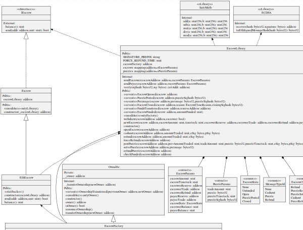

**Nov 19 2019 (Edit):** We have published a description of why we moved to create2. [Read all about it](../26/index.html).

**Nov 15 2019 (Edit):** As we have now transitioned our smart contracts from `Create` to `Create2`. Thus the design of Arwen’s Ethereum escrows as stated in this blog entry are out of date. Our factory contract no longer has self-destruct.

At Arwen we are adding support for Ethereum to our non-custodial trading software. The first step when we added Ethereum testnet support to the Arwen app a few months ago, allowing us and our users to experiment with Ethereum trades. We are now preparing to move to mainnet Ethereum. As part of the process, today we announce that we have open sourced our Ethereum smart contracts ([clone them on github](https://github.com/cwcrypto/arwen-eth-contracts/)). We have also completed a professional third party audit of these contracts performed by Zerotrust/LevelK.

Arwen’s Ethereum smart contracts are used to create Arwen escrows on the Ethereum blockchain. These escrows are the foundation of Arwen’s layer two blockchain protocol. They enable Arwen to provide instant cross-chain atomic trades. For an overview of how Arwen works, please see [our whitepaper](https://eprint.iacr.org/2020/024.pdf) or [this earlier blog post](https://medium.com/arwensecure/arwen-and-malleability-50936963e8e3). This post covers the design and features of our Ethereum smart contracts.

Meet the parties
====

As far as our escrow contracts are concerned there are only two parties:

**The Escrower:** The party that will be selling the ETH in the escrow. The Escrower locks the ETH to sell in the escrow.

**The Payee:** The party that will buy the ETH in the escrow.
In our protocol, one of these parties is always the user and the other party is a liquidity provider such as an exchange, OTC desk or smart order router. For the brevity in our examples will assume the liquidity provider is always an exchange. If the Escrower is the exchange, then the exchange is just matching the user’s buy order against a sell order on the exchange’s orderbook.
The Escrower and the Payer interact with three smart contracts: the escrow contract, the factory contract and the library contract. The escrow contract provides an address to which funds can be sent and locked in escrow. The factory contract is used to create a new escrow contracts. The library contract which holds the logic and state for all the escrows that have been created.

The stages of an Arwen ETH escrow
====

Lets walk through how these interactions happen in the life cycle of an Arwen Ethereum escrow.

**I. Escrow Creation:** When the Escrower would like to create an Arwen escrow, they call the factory contract with a create escrow message. The factory contract then creates the escrow according to the parameters in the create escrow message. The escrow's state is nowUnfunded.

**II. Escrow Funding:** Once an escrow has been created the Escrower must fund the escrow. To do this the Escrower sends the ETH they want to lock to the escrow to the address of the escrow. The escrow’s state is now Open. The escrow can now be used for trading.

**III. Trading:** The user performs trades with the exchange using the coins in the escrow. These trades are off-chain atomic swaps using the Arwen protocol as described in our whitepaper.

**IV. Closing:** When the user wishes to stop trading they call a method on the library contract to tell it to close the Arwen escrow. Typically this takes the form of a jointly signed cashout message that closes the escrow and pays each party their final balance. This sets the escrows’s state toClosed preventing any further trading.

Upgrading Arwen’s escrows
====

It is extremely important to us that parties trading via our protocol need only to trust the underlying blockchains and do not need to trust us. There is a trend toward designing smart contracts such that the creator has the ability to change the smart contract. We explicitly choose NOT to do this. We have no such keys, nor do we have any such capability. Our only capability is the ability to disable the creation of new escrows by an escrow factory.
This is because our protocols MUST be trustless! Thus the design of our upgrade mechanism had two critical requirements:

* Upgrading escrows must be safe, easy and simple.

* The logic and behavior of escrows once created must be immutable.

To satisfy both of these requirements we built the following upgrade mechanism:

1. Deploy a new contract factory, that points the escrows it creates at new library contract with the upgraded functionality.

2. Disable old contract factory via the self-destruct method. This prevents users from creating escrows that call the old library contract. Existing escrows created by the old contract factory are not impacted and can still call the old library.

3. New escrows can only be created from the new contract factory and thus all new escrow contracts must call the new library contract.

This system enables us to add or change features without granting us any dangerous powers.

View our Contracts on Etherscan
====

A wise fox examines the code of a smart contract (1460)

You can see the deployed smart contract for [our library](https://etherscan.io/address/0xf51e2a7768ed403d9c8bfb2479706ced1aa94d53#code) and [factory contract](https://etherscan.io/address/0xdaae1896e74e9a46f952292fef8bfc9d53b98251#code) on Etherscan. A note to the reader from a distant future: these contracts were deployed on Nov 4, 2019. They may not be the current contracts used by Arwen in your distant age!