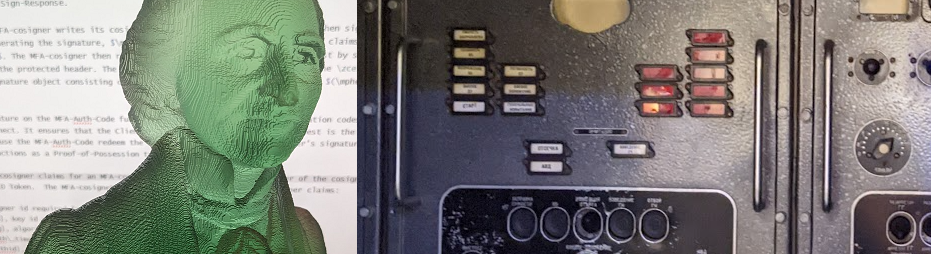

2022 was quite the year. It both doesn't feel like a year has passed and yet it feels like a decade has run it's course. I only accomplished fraction of what I planned to get done and yet I got a lot done.

<!-- {width=800 height=100} -->

What I got done in 2022:

* I wrote my thesis, defended it and graduated in 2022. I am now the holder of a PhD. in Computer Science from Boston University. My degree is issued as a [Verifiable Credential](https://www.w3.org/TR/vc-data-model/) and [cryptographically attested by BU](https://www.bu.edu/phpbin/cecredential/validate/index.php).
* The company I cofounded, [BastionZero](https://www.bastionzero.com), [raised Six million dollars](https://www.bloomberg.com/press-releases/2022-03-02/bastionzero-raises-6m-to-lock-down-remote-access-to-backend-infrastructure-with-unique-security-model), and was [the runner up at the RSAC Innovation Sandbox Contest](https://www.bastionzero.com/rsa-2022). Sharon did an excellent job pitching the company at the sandbox, go watch the talk [here](https://www.youtube.com/watch?v=TFCj6l7WpHw). BastionZero now has a double digit set of customers.
* I managed to fleshed out in my head the long term set of protocols for BastionZero. It took me two years to get this point and I only really arrived at this point in late November. Feels good.
* I helped design, build and get out the door a number of critical features for BastionZero including service accounts.
* I learned OpenID Connect at a deep level.
* Gained a good understanding of Wireguard by reading the wireguard codebase and writing a prototype VPN using wireguard.
* And a countless collection of smaller things including: learning Blender, figuring out unittesting in go-lang, reviewing papers ...

What I wanted to get done in 2022 but didn't:

* I have three papers I've been writing over the last few years and they just haunt me. They wake me up at all hours and ask why they aren't done. I had hoped to publish at least one of them 2022 and came very close but I didn't manage to get it over the line before I got buried in the wave of end of year tasks.
* I was also  eagar to get my OP_CAT BIP (Bitcoin Improvement Proposal) out in public. I managed to write most of it up but I haven't had the three weekends in a row it would take to get it releasable.
* Having a deep understanding of Kubernetes is something I've wanted for a while. I planned to achieve in 2022 but Kubernetes ran out the clock.
* I've been off and on designing and playtesting this game about operational tempo. It felt close to ready in the summer but that was just an illusion born of hope and summer dreams.
* Unscrewing things with a screwdriver or wrench offends my laziness. To remedy this I've designed a fastener which functions like a combination lock. To disassemble an object merely enter the correct combination and it comes apart. I didn't manage to get a 3D printed prototype done. This is the sort of stuff I get up to when I can't sleep but I'm too tired to really think.
  
What I am looking forward to finishing in 2023:

* I've just finished the first draft of paper that describes one of the core protocols we invented at BastionZero. It will be publicly released before the Janurary is over. I'm resisting the urge to just send it to random people but I am impatient for feedback for from the security and authentication community.
* By the year of the I year I hope to have published the full description of security system and protocols we are building at BastioZero. If it is us or someone else I strongly believe that the protocols we have built at BastionZero will be the way the world does Authentication, Authorization and Access in a decade. I think we can get there 8 years early. I feel this deep sense of urgency to get this published and then build it.
* Get OP_CAT as a offical BIP so that either get OP_CAT into Bitcoin or everyone reaches the conclusion that it will never happen.
* Publishing at least one if not two of the papers currently haunting me.
* Write one blog entry a week in this blog for all 52 weeks of the year.

2023 looks to be even more of a year than 2022.