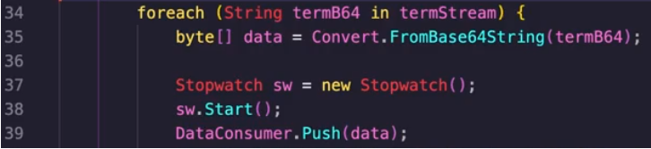
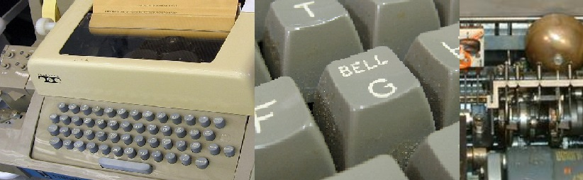
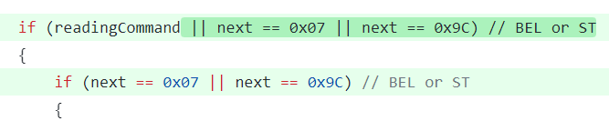

A few months ago I got to debug and [fix](https://github.com/darrenstarr/VtNetCore/pull/14) an interesting bug in the Csharp virtual terminal library [VtNetCore](https://github.com/darrenstarr/VtNetCore).
We use VtNetCore at [BastionZero](https://bastionzero.com) to extract terminal commands in realtime from user terminal sessions as they flow over the wire. This requires feeding the standard out and standard err of a terminal session into VtNetCore and then detecting when a user has entered a command and finding for the command in the rendered screen buffer of VtNetCore. We begin noticing that sometimes commands would stop being extracted from a session and that after this the command extraction thread would starting taking increasing long times to finish. 

Replication
====

I started off trying to replicate this behavior in a dev instance of our service. This was the hardest part of the debugging it involved lots of guess work. I was eventually able to replicate the issue by running tmux and then running top in one of the tmux panes. Once I could replicate the behavior I recorded the terminal session into an [asciinema](https://asciinema.org/) file using bastionzero's session recording feature. I then wrote a unittest which replayed the asciicinema file into VtNetCore. This was the biggest "ah ha!" moment because it meant I could do a repeatable clean room replication of the bug.



Unfortunately the recorded terminal session was far too large to read by hand and look for issues. To find the offending chunk of the session recording, I wrote an automated test which would repeatly rerun the session recording onto VtNetCore but on each rerun would drop one more byte from the front of the asciinema session recording and then check if the bug was replicated. Once I found the offset in which the bug stopped appearing, I knew exactly the right bytes in the session recording that trigger the bug. 

It was: `'\u001b' , ']', '1', '1', '2', ...`

A little bit of googling and I discover that this is the terminal escape sequence for OSC-112 "reset text cursor color".

But what are terminal escape sequences?
========

Terminal escape sequences are ways that the server in a terminal session can signal special instructions to the terminal running on the client. They can let a server change the color of the text, move the cursor to a different position, rewrite what is shown in the title bar of the terminal, etc... Typically they start with the byte `\u001b` called the ASCII `ESC` character. `ESC` is the [27th ASCII character](https://en.wikipedia.org/wiki/ASCII#Escape). It is used primarly for signaling that a terminal should treat the next few bytes as an escape sequence.

The terminal escape sequences ocean is deep and dark. There are an many types of escape sequences. I've yet to find even a complete listing of all of them. No terminal supports all of them. They have just been layered on decade after decade afte decade. [OSC-1337 is used to copy files to a remote server](https://chromium.googlesource.com/apps/libapps/+/master/hterm/doc/ControlSequences.md#OSC-1337) or DECALN which triggered by the byte sequence `ESC`, `#`, `8`, [will print a screen alignment test on your terminal\(https://vt100.net/docs/vt510-rm/DECALN.html). In this case OSC-112 is an OSC (Operating System Control) terminal escape sequence.

OSC terminal sequences [are documented in xterm](https://invisible-island.net/xterm/ctlseqs/ctlseqs.html#h3-Operating-System-Commands) as having the following format:
```
OSC Ps ; Pt BEL
Ps   A single (usually optional) numeric parameter, composed of one or more digits.
Pt   A text parameter composed of printable characters.
If no parameters are given, this control has no effect.
```
Where OSC is the escape sequence, `ESC ]` a.k.a, `\u001b]`.

[ECMA-48](https://www.ecma-international.org/publications-and-standards/standards/ecma-48/) provides the following description of OSC.
```
OSC - OPERATING SYSTEM COMMAND
Notation: (C1)
Representation: 09/13 or ESC 05/13
OSC is used as the opening delimiter of a control string for operating system use. The command string
following may consist of a sequence of bit combinations in the range 00/08 to 00/13 and 02/00 to 07/14.
The control string is closed by the terminating delimiter STRING TERMINATOR (ST). The
interpretation of the command string depends on the relevant operating system. 
```

[OSC 112 - reset cursor color](https://terminalguide.namepad.de/seq/osc-112/): resets the color of the text cursor. Since OSC-112 does that have a Pt (text parameter) and thus can is specified as either:
* `ESC ]112 BELL` (`\u001b]112\u0007`)
or 
* `ESC ]112; BELL` (`\u001b]112;\u0007`)

Tmux uses the version without the `;`. For instance in [tmux/tty-features.c](https://github.com/tmux/tmux/blob/9c34aad21c0837123a51a5a4233a016805d3e526/tty-features.c#L206) tmux defines OSC-112 as:
```cpp
/* Terminal supports cursor colours. */
static const char *const tty_feature_ccolour_capabilities[] = {
 	"Cs=\\E]12;%p1%s\\a",
 	"Cr=\\E]112\\a",
 	NULL
};
```

Why is OSC-112 causing problems in VtNetCore? Does it Ring a BELL?
====
To discover the root cause I hooked a debugger up to my replication test and stepped through it line by line. After an hour of investigation I discovered that the root cause was that VtNetCore had a parsing bug in how it handled the terminal control sequence OSC-112 (Operation System Sequences). The [OSC parser (ConsumeOSC) in VtNetCore](https://github.com/darrenstarr/VtNetCore/blob/060a72f074aafb8f8720f41616727a69755dade7/VtNetCore/XTermParser/XTermSequenceReader.cs#L114) assumes that [OSC control sequences](https://chromium.googlesource.com/apps/libapps/+/nassh-0.8.41/hterm/doc/ControlSequences.md#OSC) always fit the pattern:

`\u001b` + `]` + `<numeric parameters>` + `<command>` + `\u0007`

This assumption is incorrect as the OSC-112 control sequence does not always have a letter after the numeric parameter 112. This means that VtNetCore's virtual terminal misses the `\u0007` [BELL character](https://en.wikipedia.org/wiki/Bell_character) that should end the control sequence and assumes that all following text is actually part of the control sequence. Since the `\u0007` (`0x07` or the `BELL` character) character is very uncommon, it will reread all input it has seen on each new value sent to the data consumer waiting for the control sequence to complete. 

For instance if the unprocessed terminal out was `\u001b, ], 1, 1, 2, \u0007, A,` it would read until it got an error because there was no bytes after `A`, it would then assume the full escape sequence isn't in the terminal yet and move  `\u001b, ], 1, 1, 2, \u0007, A,` back to the unprocessed buffer. When it gets another character, say `B`, it would append it to unprocessed buffer and then read `\u001b, ], 1, 1, 2, \u0007, A, B` run out of data to process and move `\u001b, ], 1, 1, 2, \u0007, A, B` back to the unprocessed buffer. It will never make progress and the unprocessed buffer will grow in size with each new value. Each time new output comes in, it will linearly read across the growing buffer. It will treat any string or any length as 'unfinished escape seqeuence' until finds a letter followed by the `\u0007` BELL character. For the truly curious I provide a detailed step through of what is happening internally in VtNetCore at the end this blog entry.

This is a big problem. Tmux will generate this control sequence on starting and thus bring down any VtNetCore virtual terminal that is reading tmux output. For instance in one tmux session I recorded the InputBuffer was 60KB and was being completely reread on each new DataConsumer.Push. This would take 7 seconds for each read of the buffer to complete and the virtual terminal would never make progress.

The irony of the solution being [a literal byte intended to ring an actual, electro-mechanical, bell on old teletype machine](https://en.wikipedia.org/wiki/Bell_character) was not lost on me.



The Fix
====

To fix this issue I added code to end an OSC escape sequence when it detects the BELL chracter `\u0007` even if no letters have been encountered. I then put together and [submitted a PR to the VtNetCore project](https://github.com/darrenstarr/VtNetCore/pull/14). This PR included my fix and unittests to replicate the issue and show that my fix resolved the bug.



 Darrenstarr, the maintainer of VtNetCore merged my PR with these kind words. I've never seen a maintainer react to a bug report with this much grace and encouragement. It made me more likely to submit PRs to opensource software in the future. 


A Step by Step Walkthrough of the Bug
====

For the truly curious, I quote from my PR and provide a step by step description of what happens internal to VtNetCore when parsing when the virtual terminal attempts to process `[\u001b, ], 1, 1, 2, \u0007, A, B, C]`

1. The InputBuffer is empty, contains 0 elements, position is 0, remainder is 0.
2. `\u001b]112\u0007ABC` is pushed to VtNetCore's DataConsumer i.e., `DataConsumer.Push("\u001b]112\u0007ABC")`. Push adds this to the InputBuffer.
3. The InputBuffer is `[\u001b, ], 1, 1, 2, \u0007, A, B, C]`, contains 8 elements, position is 0, remainder is 8
4. VtNetCore reads `\u001b` and determines it is entering an escape sequence,
5. VtNetCore reads `]` and determines the escape sequence is an OSC sequence and uses ConsumeOSC to parse the OSC sequence
6. ConsumeOSC reads `1`, `1`, `2` as numeric parameters,
7. ConsumeOSC reads the bell character `\u0007` and sets `readingCommand = true;`
8. ConsumeOSC reads `A` assuming it is part of the command,
9. ConsumeOSC reads `B` assuming it is part of the command,
10. ConsumeOSC reads `C` assuming it is part of the command,
11. When it runs to the end of the InputBuffer it throws IndexOutOfRangeException,
12. This Exception is handled in the [DataConsumer L:102](https://github.com/darrenstarr/VtNetCore/blob/060a72f074aafb8f8720f41616727a69755dade7/VtNetCore/XTermParser/DataConsumer.cs#L102)
13. The InputBuffer is `[\u001b, ], 1, 1, 2, \u0007, A, B, C]`, contains 8 elements, position is 8, remainder is 0
14. The code handling the IndexOutOfRangeException in DataConsumer calls `InputBuffer.PopAllStates()`,
15. The InputBuffer is `[\u001b, ], 1, 1, 2, \u0007, A, B, C]`, contains 8 elements, position is 0, remainder is 8
16. DataConsumer.Push("\u001b]112\u0007ABC")` returns
17. The user then calls DataConsumer.Push("DEFG")`
18. Push adds this to the InputBuffer. The InputBuffer is `[\u001b, ], 1, 1, 2, \u0007, A, B, C, D, E, F, G]`, contains 12 elements, position is 0, remainder is 12,
19. The previous steps repeat with ConsumeOSC now believing `ABCDEFG` is the beginning of the OSC command,
20. As before when it runs to the end of the InputBuffer it throws IndexOutOfRangeException and resets the position,
21.  The InputBuffer is `[\u001b, ], 1, 1, 2, \u0007, A, B, C, D, E, F, G]`, contains 12 elements, position is 0, remainder is 12,
22.  This continues with VtNetCore scanning over the ever growing input buffer on every `Push` but never making any progress.
