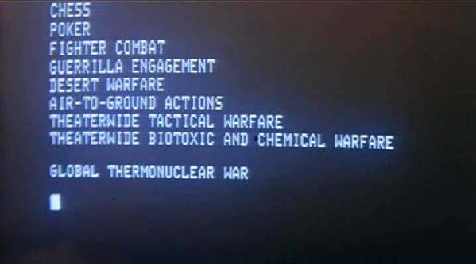

This post is the first of several posts inspired by the game of flipIt.
FlipIt is a [strategic game](http://en.wikipedia.org/wiki/Game_theory) created by Marten van Dijk, Ari Juels, Alina Oprea, and Ronald L. Rivest and introduced in the paper [FLIPIT: The Game of “Stealthy Takeover”](http://www.rsa.com/rsalabs/presentations/Flipit.pdf).

**Play FlipIt:** 
After seeing [a talk about flipIt](http://www.rsa.com/rsalabs/presentations/Riv11b.slides.pdf) and unable to find any playable version online, I decide to write my own (which to the best of knowledge is the only playable version of flipIt online). 
To play flipIt click [here](http://ethanheilman.github.com/flipIt/playable_with_instructions.html).
The source code and documentation plus additional modes can be found on github [here](https://github.com/EthanHeilman/flipIt).
It is written using javascript and HTML5 so it will likely only work on chrome, firefox or possibly the latest version of IE.

**Spy vs Spy:**
[Aldrich Ames](http://en.wikipedia.org/wiki/Aldrich_Ames) was a CIA Counter-Intelligence officer.
He was also a spy feeding valuable intelligence to the Soviets and compromising US intelligence operations in the Soviet Union.
He operated for ~9 years before the CIA recognized that they had a spy and began an investigation and determined that he was the leak.
This strategic situation is the same one faced by computer networks, drug cartels, intelligence agencies and guerrilla networks.

All such organisations have a reasonable expectation that trusted personal/systems will eventually be recruited/captured by enemy organisations.
Therefore such organisations must consume valuable resources to discover such betrayals and thereby regain secrecy.
The question is then given the possible threats how often and at what cost should they spend resources on investigations/spy hunts/virus scans.
This is where flipIt comes in.

**FLIPIT: The Game of “Stealthy Takeover:”**
FlipIt was created to model these sorts of strategic situations and to study the best courses of action.
Specifically flipIt was motivated by the recent interest in and success of [Advanced Persistent Threats](http://en.wikipedia.org/wiki/Advanced_persistent_threat), or APTs[^1].

The basic idea is that given the current experience that perfect protection of trusted resources is unattainable, lets think about how we can optimally manage compromises of the our most trusted systems. 

**Rules**

1. Two players, player X (blue) and player Y (red) attempt to maintain control over a shared resource.
2. At anytime in the game each player is allowed to play 'flip'.
3. The only way a player can learn the state of the game (who is in control) is when they play 'flip'.
4. If a player is in control of the resource and they play 'flip' they remain in control of the resource.
5. If a player is not in control of the resource and they play 'flip' they gain control of the resource.
6. Players gain points for the length of time they control the resource.
7. Players lose points every time they play flip.

This reflects the situation that the CIA is placed in with regard to moles/enemy spies.
They don't know if they have been compromised. 
They can perform an investigation and determine if they have been compromised, also catching the spy in the act, but this action is very expensive.
That is, the CIA has to trade off between remaining "mole free" (a good) and investigations (an expense).

**Winning:**
How do you win[^2] a fair game of flipIt against intelligent adaptive human adversaries? 
I'm not sure.

In the real world what is the best move given that the other "players" can secretly capture/corrupt your most trusted personal/systems?
Rivest suggests in his [talk](http://www.rsa.com/rsalabs/presentations/Riv11b.slides.pdf) that you:

* "Be prepared to deal with repeated total
failure (loss of control).
* Play fast! Aim to make opponent drop out![^3]
* Arrange game so that your moves cost much less than your opponent’s!"

I will discuss this theme of success through affordable defeat (you win if you can afford to lose many times) [in my next blog entry.](http://ethanheilman.tumblr.com/post/27979232885/castle-meet-cannon-what-to-do-after-you-lose)

[^1]: There is some debate on what constitutes an Advanced Persistent Threats. 
For me the question is not what is the most semantically correct use of the word, but rather which is the most useful use. 
For absolute utility the definition given by Bruce Schneier definition hits the mark. 
He argues that an APT is distinguished not by solely by being highly capable but by being highly motivated to gain access to *specific* system or piece of information. 
>"A conventional hacker or criminal isn't interested in any particular target. He wants a thousand credit card numbers for fraud, or to break into an account and turn it into a zombie, or whatever. Security against this sort of attacker is relative; as long as you're more secure than almost everyone else, the attackers will go after other people, not you. An APT is different; it's an attacker who -- for whatever reason -- wants to attack you. Against this sort of attacker, the absolute level of your security is what's important. It doesn't matter how secure you are compared to your peers; all that matters is whether you're secure enough to keep him out." -  [Bruce Schneier: APT is a Useful Buzzword.](http://www.schneier.com/blog/archives/2011/11/advanced_persis.html)
 
[^2]: The [paper](http://www.rsa.com/rsalabs/presentations/Flipit.pdf) provides very interesting mathematically rigorous winning strategies against certain types of constrained attackers.
What happens when two humans play?

[^3]: This is very similar to strategies advocated by John Boyd of getting inside your adversaries [OODA loop](http://en.wikipedia.org/wiki/OODA_loop) by having a faster loop.
In flipIt it is about moving cheaper rather than faster. 

