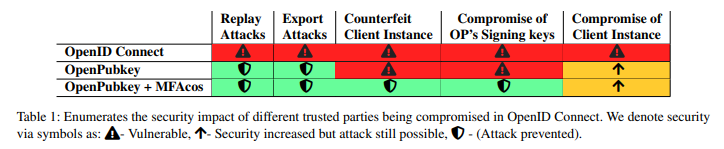

We recently released a draft of [OpenPubkey: Augmenting OpenID Connect with User held Signing Keys](https://eprint.iacr.org/2023/296.pdf). BastionZero uses OpenPubkey to cryptographically bind your public key to your identity using OpenID Providers[^1] like Google or Okta. OpenPubkey offers a significant security upgrade over regular [OpenID Connect](https://en.wikipedia.org/wiki/OpenID) by allowing users can to sign messages and requests under their identity without adding any additional trusted parties. Additionally when used with MFA, OpenPubkey removes the trust placed in OpenID Providers so that they are no longer as a single point of compromise.

## OpenPubkey Transforms Authentication on the Web

OpenPubkey enables users to cryptographically sign messages with their identity. Our approach to providing this long-awaited functionality has a number of advantages:

* **Ease of use:** OpenPubkey offers a simple and compatible method for employing cryptographic signatures on the web, eliminating typical usability issues.
* **Invisible:** As most users already have accounts with OpenID Providers, OpenPubkey integrates so smoothly into existing user workflows it is invisible to users.
* **Ephemeral secrets:** Users' public keys and signing keys are ephemeral, generated upon login and deleted upon logout, eliminating the security risks and headaches of long-lived secrets and keys.
* **Fully Compatibility with OpenID Connect:** OpenPubkey is so compatible with existing OpenID Providers that they cannot even tell that OpenPubkey is being used. BastionZero has been using a version of this OpenPubkey for over a year to offer secure access to servers and kubernetes.
* **No permission required:** Anyone can deploy OpenPubkey.

## How OpenPubkey works

We are going to use Google as our example OpenID Provider, but OpenPubkey is currently being used with other OpenID Providers including: Microsoft, Okta, OneLogin, etc.

When you click an OpenID button such as: “Sign In With Google”:

1. The client, often javascript running in your browser, sends a random value, called a nonce, to Google,
2. Google authenticates your identity based on your current session with Google and then signs an ID Token under Google’s Signing Key. This ID Token says who you are according to Google: “This user is Alice@gmail.com”. This ID Token includes the nonce, i.e., the random value your client sent.
3. You can use this ID Token to authenticate to a webapp, as the webapp can check that the ID Token was signed by Google. Google's public keys can be found here: [https://googleapis.com/oauth2/v3/certs](https://googleapis.com/oauth2/v3/certs)
4. Once the webapp verifies Google’s signature, it is convinced of your identity. That is, it believes you are is Alice@gmail.com because Google said so in the ID Token.

OpenPubkey augments OpenID Connect so that not only does Google specify your identity in the ID Token it also includes your public key in the ID Token. Your public and signing keys are generated when you click the “Sign In With Google'' button. The public key is then included in the nonce value sent to Google. OpenID Connect requires that Google include in the ID Token it issues the nonce that was sent. Since the nonce now includes your public key, Google is acting like a Certificate Authority and signing an ID Token that includes both the user’s identity and the user’s public key.

For example consider receiving the following ID Token signed by Google which says:
"Alice@gmail.com's public key is 0x43E5…FF". If you then get a message signed under that same public key 0x43E5…FF which says: “I, Alice@gmail.com, would like to open a connection to the server xyz.abc.net", you can verify if the message you received was actually signed by Alice.

At a high level this is how BastionZero works: the server which a user wishes to access, checks the name and public key of the user based on the ID Token.

<!--  -->

In BastionZero we developed the ZLI to act as the OpenPubkey client. The ZLI is a native application which is open source so companies and users don’t need to trust us. They can just read the code.

## Eliminating the OpenID Provider as a Single Point of Compromise

OpenID Connect trusts OpenID Providers to accurately attest to user identities. If a malicious party were to obtain Google's Signing Key, they could falsely claim to be Alice and link their public key to their identity. As cryptographers, it is in our nature to eliminate [Single Points of Compromise (SPoCs)](https://en.wikipedia.org/wiki/Single_point_of_failure) like this.

To address this, OpenPubkey introduces an additional party called the MFA-Cosigner, which authenticates users using Multi-Factor Authentication (MFA). This results in two independent signed statements about Alice's identity:

* ID Token Signed by Google: "Alice@gmail.com's public key is 0x43E5…FF"
* ID Token signed by the MFA-Cosigner:
"I, the MFA-Cosigner, independently authenticated Alice@gmail.com, and her public key is 0x43E5…FF"

If an MFA-Cosigner is used then security remains intact even if the OpenID Provider (Google) is malicious or compromised. Likewise, if an MFA-Cosigner is compromised and the OpenID Provider is not, security is still maintained.

While OpenPubkey can function without the MFA-Cosigner, the inclusion of the MFA-Cosigner significantly enhances security compared to using OpenID Connect or OpenPubkey alone.

For a deeper discussion of OpenPubkey's security, refer to the [OpenPubkey paper](https://eprint.iacr.org/2023/296.pdf).

Originally published at [bastionzero.com/blog](https://www.bastionzero.com/blog/bastionzeros-openpubkey-why-i-think-it-is-the-most-important-security-research-ive-done).

[^1]: OpenID Providers (OPs) are a type of Identity Provider (IdP). If IdP is a more familar term to you just replace OP with IdP in your mind.