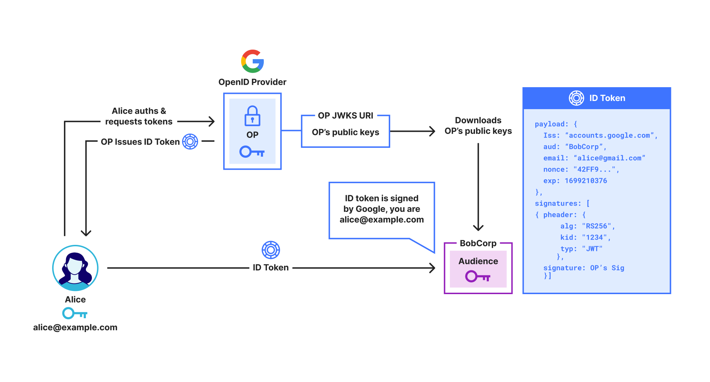
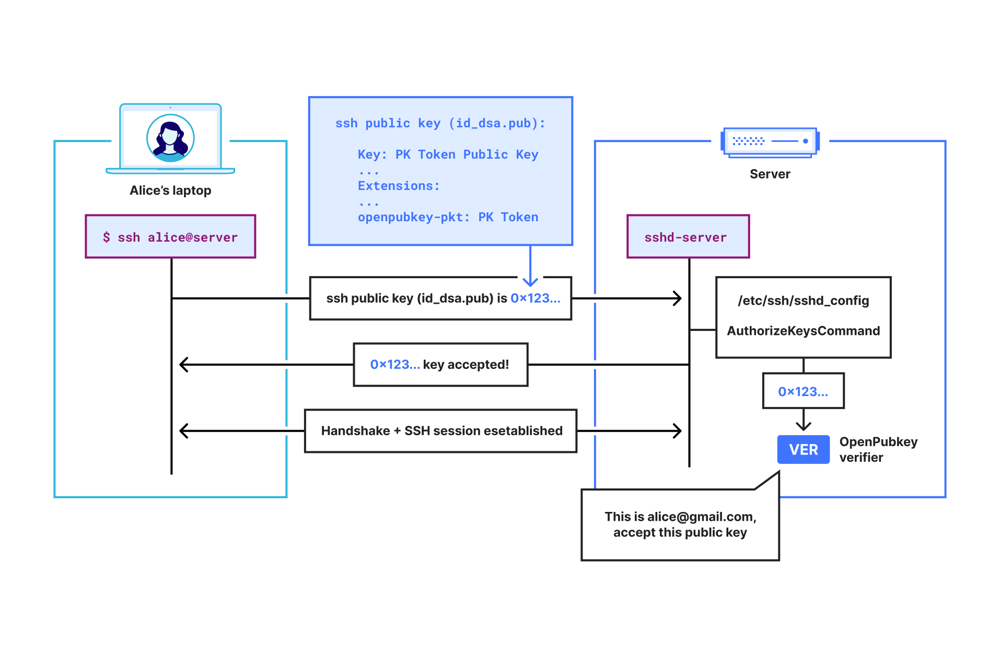

OPKSSH makes it easy to [SSH](https://en.wikipedia.org/wiki/Secure_Shell) with single sign-on technologies like OpenID Connect, thereby removing the need to manually manage and configure SSH keys. It does this without adding a trusted party other than your identity provider (IdP).

We are excited to announce [OPKSSH (OpenPubkey SSH)](https://github.com/openpubkey/opkssh/) has been open-sourced under the umbrella of the OpenPubkey project. While the underlying protocol OpenPubkey became [an open source Linux foundation project in 2023](https://www.linuxfoundation.org/press/announcing-openpubkey-project), OPKSSH was closed source and owned by[ BastionZero (now Cloudflare)](https://www.cloudflare.com/press-releases/2024/cloudflare-acquires-bastionzero-to-add-zero-trust-infrastructure-access/). Cloudflare has gifted this code to the OpenPubkey project, making it open source.

In this post, we describe what OPKSSH is, how it simplifies SSH management, and what OPKSSH being open source means for you.

## Background

A cornerstone of modern access control is [single sign-on (SSO)](http://cloudflare.com/learning/access-management/what-is-sso/), where a user authenticates to an [identity provider (IdP)](https://www.cloudflare.com/learning/access-management/what-is-an-identity-provider/), and in response the IdP issues the user a token. The user can present this token to prove their identity, such as “Google says I am Alice”. SSO is the rare security technology that both increases convenience — users only need to sign in once to get access to many different systems — and increases security.

## OpenID Connect

[OpenID Connect (OIDC)](https://openid.net/developers/how-connect-works/) is the main protocol used for SSO. As shown below, in OIDC the IdP, called an OpenID Provider (OP), issues the user an ID Token which contains identity claims about the user, such as “email is alice@example.com”. These claims are digitally signed by the OP, so anyone who receives the ID Token can check that it really was issued by the OP.

Unfortunately, while ID Tokens do include identity claims like name, organization, and email address, they do not include the user’s public key. This prevents them from being used to directly secure protocols like SSH or [End-to-End Encrypted messaging.](https://www.cloudflare.com/learning/privacy/what-is-end-to-end-encryption/)

Note that throughout this post we use the term OpenID Provider (OP) rather than IdP, as OP specifies the exact type of IdP we are using, i.e., an OpenID IdP. We use Google as an example OP, but OpenID Connect works with Google, Azure, Okta, etc.



## OpenPubkey

OpenPubkey, shown below, adds public keys to ID Tokens. This enables ID Tokens to be used like certificates, e.g. “Google says alice@example.com is using public key 0x123.” We call an ID token that contains a public key a PK Token. The beauty of OpenPubkey is that, unlike other approaches, OpenPubkey does not require any changes to existing SSO protocols and supports any OpenID Connect compliant OP.


OpenPubkey enables ID Tokens to be used as certificates, OPKSSH extends this functionality so that these ID Tokens can be used as SSH keys in the SSH protocol. This adds SSO authentication to SSH without requiring changes to the SSH protocol.

## Why this matters

OPKSSH frees users and administrators from the need to manage long-lived SSH keys, making SSH more secure and more convenient.

> “In many organizations – even very security-conscious organizations – there are many times more obsolete authorized keys than they have employees. Worse, authorized keys generally grant command-line shell access, which in itself is often considered privileged. We have found that in many organizations about 10% of the authorized keys grant root or administrator access. SSH keys never expire.”  
> \- [Challenges in Managing SSH Keys – and a Call for Solutions](https://ylonen.org/papers/ssh-key-challenges.pdf) by [Tatu Ylonen](https://ylonen.org/) (Inventor of SSH)

In SSH, users generate a long-lived SSH public key and SSH private key. To enable a user to access a server, the user or the administrator of that server configures that server to trust that user’s public key. Users must protect the file containing their SSH private key. If the user loses this file, they are locked out. If they copy their SSH private key to multiple computers or back up the key, they increase the risk that the key will be compromised. When a private key is compromised or a user no longer needs access, the user or administrator must remove that public key from any servers it currently trusts. All of these problems create headaches for users and administrators.

### OPKSSH overcomes these issues

**Improved security:** OPKSSH replaces long-lived SSH keys with ephemeral SSH keys that are created on-demand by OPKSSH and expire when they are no longer needed. This reduces the risk a private key is compromised, and limits the time period where an attacker can use a compromised private key. By default, these OPKSSH public keys expire every 24 hours, but the expiration policy can be set in a configuration file.

**Improved usability:** Creating an SSH key is as easy as signing in to an OP. This means that a user can SSH from any computer with opkssh installed, even if they haven’t copied their SSH private key to that computer.

To generate their SSH key, the user simply runs opkssh login, and they can use ssh as they typically do.

**Improved visibility:** OPKSSH moves SSH from authorization by public key to authorization by identity. If Alice wants to give Bob access to a server, she doesn’t need to ask for his public key, she can just add Bob’s email address bob@example.com to the OPKSSH authorized users file, and he can sign in. This makes tracking who has access much easier, since administrators can see the email addresses of the authorized users.

OPKSSH does not require any code changes to the SSH server or client. The only change needed to SSH on the SSH server is to add two lines to the SSH config file. For convenience, we provide an installation script that does this automatically, as seen [in this video](figs/opkssh-movie.mov).

## How it works



Let’s look at an example of Alice (alice@example.com) using OPKSSH to SSH into a server:

1. lice runs opkssh login. This command automatically generates an ephemeral public key and private key for Alice. Then it runs the OpenPubkey protocol by opening a browser window and having Alice log in through their SSO provider, e.g., Google.

2. If Alice SSOs successfully, OPKSSH will now have a PK Token that commits to Alice’s ephemeral public key and Alice’s identity. Essentially, this PK Token says “alice@example.com authenticated her identity and her public key is 0x123…”.

3. OPKSSH then saves to Alice’s .ssh directory:

    - an SSH public key file that contains Alice’s PK Token
    - and an SSH private key set to Alice’s ephemeral private key.

4. When Alice attempts to SSH into a server, the SSH client will find the SSH public key file containing the PK Token in Alice’s .ssh directory, and it will send it to the SSH server to authenticate.

5. The SSH server forwards the received SSH public key to the OpenPubkey verifier installed on the SSH server. This is because the SSH server has been configured to use the OpenPubkey verifier via the AuthorizedKeysCommand.

6. The OpenPubkey verifier receives the SSH public key file and extracts the PK Token from it. It then verifies that the PK Token is unexpired, valid, signed by the OP and that the public key in the PK Token matches the public key field in the SSH public key file. Finally, it extracts the email address from the PK Token and checks if alice@example.com is allowed to SSH into this server.

Consider the problems we face in getting OpenPubkey to work with SSH without requiring any changes to the SSH protocol or software:

**How do we get the PK Token from the user’s machine to the SSH server inside the SSH protocol?** We use the fact that SSH public keys can be SSH certificates, and that SSH certificates have [an extension field](https://cvsweb.openbsd.org/cgi-bin/cvsweb/src/usr.bin/ssh/Attic/PROTOCOL.certkeys?rev=1.4&content-type=text/x-cvsweb-markup) that allows arbitrary data to be included in the certificate. Thus, we package the PK Token into an SSH certificate extension so that the PK Token will be transmitted inside the SSH public key as a normal part of the SSH protocol. This enables us to send the PK Token to the SSH server as additional data in the SSH certificate, and allows OPKSSH to work without any changes to the SSH client.

**How do we check that the PK Token is valid once it arrives at the SSH server?** SSH servers support a configuration parameter called the [AuthorizedKeysCommand](https://man.openbsd.org/sshd_config#AuthorizedKeysCommand) that allows us to use a custom program to determine if an SSH public key is authorized or not. Thus, we change the SSH server’s config file to use the OpenPubkey verifier instead of the SSH verifier by making the following two line change to sshd_config:

```bash
AuthorizedKeysCommand /usr/local/bin/opkssh verify %u %k %t
AuthorizedKeysCommandUser root
```

The OpenPubkey verifier will check that the PK Token is unexpired, valid and signed by the OP. It checks the user’s email address in the PK Token to determine if the user is authorized to access the server.

**How do we ensure that the public key in the PK Token is actually the public key that secures the SSH session?** The OpenPubkey verifier also checks that the public key in the public key field in the SSH public key matches the user’s public key inside the PK Token. This works because the public key field in the SSH public key is the actual public key that secures the SSH session.

## What is happening

We have [open sourced OPKSSH](https://github.com/openpubkey/openpubkey/pull/234) under the [Apache 2.0 license](https://www.apache.org/licenses/LICENSE-2.0), and released it as [openpubkey/opkssh on GitHub](https://github.com/openpubkey/opkssh/). While the OpenPubkey project has had code for using SSH with OpenPubkey since the early days of the project, this code was intended as a prototype and was missing many important features. With OPKSSH, SSH support in OpenPubkey is no longer a prototype and is now a complete feature. Cloudflare is not endorsing OPKSSH, but simply donating code to OPKSSH.

**OPKSSH provides the following improvements to OpenPubkey:**

- Production ready SSH in OpenPubkey
- Automated installation
- Better configuration tools

## To learn more

See the [OPKSSH readme](https://github.com/openpubkey/opkssh/blob/main/README.md) for documentation on how to install and connect using OPKSSH.

## How to get involved

There are a number of ways to get involved in OpenPubkey or OPKSSH. The project is organized through the [OPKSSH GitHub](https://github.com/openpubkey/opkssh). We are building an open and friendly community and welcome pull requests from anyone. If you are interested in contributing, see [our contribution guide](https://github.com/openpubkey/openpubkey/blob/main/CONTRIBUTING.md).

We run a [community meeting every month](https://github.com/openpubkey/community) which is open to everyone, and you can also find us over on the [OpenSSF Slack](https://openssf.org/getinvolved/) in the #openpubkey channel.

----

See discussion of post on [hackernews - Open-sourcing OpenPubkey SSH (OPKSSH): integrating single sign-on with SSH (cloudflare.com)](https://news.ycombinator.com/item?id=43470906).

The blog post originally appeared on the Cloudflare blog as ["Open-sourcing OpenPubkey SSH (OPKSSH): integrating single sign-on with SSH" (2025-03-25).](https://blog.cloudflare.com/open-sourcing-openpubkey-ssh-opkssh-integrating-single-sign-on-with-ssh/). A number of people at cloudflare improved this blog posts, helped edit this post and the figures.
