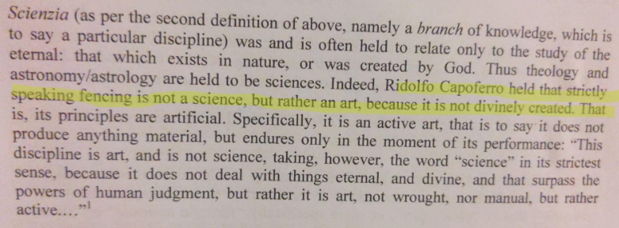

        

[W. Jherek Swanger](https://wiktenauer.com/wiki/W._Jherek_Swanger) writes in his introduction to Camillo[^7] Agrippa's "A Treatise on the Science of Arms, with a philosophical Dialogue (1553)" that:

> "Scienzia [...] was and is often held to relate only to the study of the eternal: that which exists in nature, or was created by God. Thus theology and astronomy/astrology are held to be sciences. Indeed, Ridolfo Capoferro held that strictly speaking fencing is not a science, but rather an art, because it was not divinely created."

16th Century Italy asks then if science is concerned only with divine (natural) knowledge[^1] and art is the realm of the secular and human-made, then was Leopold Kronecker right when he said[^2]:

> "God made the integers; all else is the work of man"

The integers look little like the natural world and very much like the simple and powerful abstractions that humans find elegant.
Much to the frustration of the human mind, that which created [fig wasps](https://en.wikipedia.org/wiki/Fig_wasp), [Leucochloridium paradoxum](https://en.wikipedia.org/wiki/Leucochloridium_paradoxum), quantum foam, and [plasmids](https://en.wikipedia.org/wiki/Plasmid), does not create works of abstract simplicity.
If such a divinity left fingerprints in mathematics, that inhuman complexity and irrational strangeness[^6] can be found in the reals but not the integers.
One can imagine the God of the [Book of Job](https://en.wikipedia.org/wiki/Book_of_Job) creating [the square root of two](https://en.wikipedia.org/wiki/Square_root_of_2) and pi.

I have an imperfect rule of thumb for determining if something is of human construction or for the purposes of this exploration, divine.
If the something under examination causes a sense of existential nausea, disorientation, and a deep feeling that is can't possibly work like that, it is divine[^3].
If on the other hand it feels universal, simple, and ideal, it is the product of human effort.

## The Hierarchy of Weirdness

This distinction science=divine/nature, art=made by human is more complex than just two separate categories.
When humans create something, the created thing is contained, and is a function of, what already exists, so while art is the part of the universe that is created by humans, it also emerges from the part of the universe that isn't created by humans.

The human idea of the triangle choke (sankaku-jime) only works because humans have arms, legs and necks.
It wouldn't be meaningful to talk about it in a universe without chokeable necks, but necks existed before human ideas.
So the idea of a triangle exists both because of the specific context of humanity and also because humans created it.

More specifically, we can define a hierarchy of creation, or what a 16th Century Italian would call divine creation.
At the top of the hierarchy we have eternal nature. Eternal nature gives rise to nature, which in turn gives rise to humans, which gives rise to human ideas.
As shown below, the closer we get to eternal nature the greater the weirdness[^5] (from a human perspective).

The real numbers are much closer to eternal nature[^4], whereas the integers are much closer to human ideas.
This is why to human mind the integers feel more perfect, feel more divine.
A hammer feels like the perfect tool to hammer a nail not because a hammer is closer to eternal nature or more divine, but because it isn't divine.
Hammers feel like the perfect tool because they were invented by humans specifically to solve the human problem of hammering nails.

## Kronecker, Cantor and God

Kronecker's quote about the integers being divine was not made so much because Kronecker wanted to elevate the reputation of the integers but because he wanted to damn infinity[^18].
It was that reaction of horror at the creepy crawly bugs you see when you lift up the rock of Mathematics.
The main target of Kronecker's campaign against infinity was the mathematician Cantor[^8] and his work on transfinites.
Cantor viewed infinity in a much more positive light and he wasn't alone in this reaction.

> "From [the paradise](https://en.wikipedia.org/wiki/Cantor%27s_paradise) that Cantor created for us no-one shall be able to expel us." - David Hilbert (1926)[^12]

Cantor's ideas also sparked a theological debate since if the mind can reason about infinity, perhaps the mind can also reason about God[^9].
Cantor himself was deeply invested in the theological implications of his mathematical work.
He believed that God was beyond the mind[^13] and thus his mathematical work was not the result of his own effort but rather God was speaking through him.

This is an inversion of [God of the gaps](https://en.wikipedia.org/wiki/God_of_the_gaps)[^10] where the gaps filled in by the God of the filling and the lack of gaps is evidence of God rather than the reverse.
This echos Descartes'[^15] deeply unsatisfying [Trademark Argument](https://en.wikipedia.org/wiki/Trademark_argument) of the existence of God because finite beings like humans can perceive aspects of God like infinity, we must only be able to perceive[^17] them because God exists.

> "The idea of infinite substance, or God, must have “proceeded from some substance which really was infinite. [..] If a finite thing could produce the idea of an infinite thing, the Meditator reasons, this would violate the principle that there is more reality in a cause than in its effect, since the Idea of God is at the top of the Hierarchy of Ideas." - René Descartes, [Meditations on First Philosophy, in which the existence of God and the immortality of the soul are demonstrated (1641)](https://archive.org/stream/descartess-meditations-an-introduction/Descartes%E2%80%99s%20Meditations%20An%20Introduction_djvu.txt)[^16]

I much prefer the notion put forward by Chesterton that it is gaps themselves which are important.

> "The whole secret of mysticism is this: that man can understand everything by the help of what he does not understand. The morbid logician seeks to make everything lucid, and succeeds in making everything mysterious. The mystic allows one thing to be mysterious, and everything else becomes lucid" - [Orthodoxy by G. K. Chesterton (1908)](https://www.gutenberg.org/files/16769/16769-h/16769-h.htm)[^14]

## A Final Note

Versions of this essay sat on my hard drive for the last few years and in private correspondence.
I couldn't find a conclusion to draw these threads together so I'm leaving it as a vibes-based meandering through these ideas.

This post originally came about because of a conversation with [Madars Virza](https://madars.org/) about my rejection of the Kronecker quote.  I bounced it off of a number of other people including Andrew Poelstra, Russell O’Connor, aardaar, Karina Poelstra, Peter Berard over the years. The observations of the real number line are taken from conversations with my dad, [Ward Heilman](https://www.bridgew.edu/department/mathematics/dr-ward-heilman). Hopefully I got it mostly correct, any errors are my own.

### Related Essays

[Ben Orlin - Why the Number Line Freaks Me Out (2016)](https://mathwithbaddrawings.com/2016/12/28/why-the-number-line-freaks-me-out/) - [archived](https://web.archive.org/web/20250221054544/https://mathwithbaddrawings.com/2016/12/28/why-the-number-line-freaks-me-out/)

[Joel David Hamkins - What are the real numbers, really? (2024)](https://www.infinitelymore.xyz/p/what-are-the-real-numbers-really) - [archived](https://web.archive.org/web/20250601000000*/https://www.infinitelymore.xyz/p/what-are-the-real-numbers-really)

[Theology Of Georg Cantor (2014), Ochiai Hitoshi](https://apeironcentre.org/theology-of-georg-cantor/)

[Russell O’Connor, How Dedekind Screwed Up a Hundred Years of Mathematics (2005)](https://r6.ca/blog/20051210T202900Z.html)

[^1]: We can ignore the question of the existence of God since by "divine" here we mean that which does not depend on us. Or in more modern atheistic terms, we are talking about nature and what if anything is prior to nature.

[^2]: We don't have Leopold Kronecker actual words. Heinrich Weber wrote in a 1893 issue of [the journal Mathematische Annalen 43(1)](https://archive.org/stream/sim_mathematische-annalen_1893_43/sim_mathematische-annalen_1893_43_djvu.txt) that Kronecker at a 1886 lecture made the statement: "Die ganzen Zahlen hat der liebe Gott gemacht, alles andere ist Menschenwerk" (translated: "God made the integers; all else is the work of man").   
The full context in German is: "Eine wesentliche Liicke wiirde aber in dem Bilde des Mathematikers Kronecker bleiben, wenn ich seine Stellung zu den fundamentalen, philosophischen Fragen der Mathematik mit Stillschweigen iibergehen wollte. Es ist ein Standpunkt, der besonders in seinen spiteren Jahren hervortrat, vielleicht mehr noch im persénlichen Verkehr als in der Oeffentlichkeit; aber auch 6ffentlich hat er seine Anschauungen nicht verleugnet und z. B. in der Festschrift zu Zeller’s Jubiléum scharf hervorgekehrt.  
In Bezug auf Strenge der Begriffe stellt er die héchsten An-forderungen und sucht alles, was Biirgerrecht in der Mathematik haben soll, in die krystallklare eckige Form der Zahlentheorie zu zwingen.  
Manche von Ihnen werden sich des Ausspruchs erinnern, den er in einem Vortrag bei der Berliner Naturforscher- Versammlung im Jahre 1886 that: ,,Die ganzen Zahlen hat der liebe Gott gemacht, alles andere ist Menschenwerk“. 
So war ihm alles, was sich nicht eines arithmetischen Ursprungs unmittelbar bewusst war, unsympathisch, und sein Streben ging dahin, nicht nur in der Algebra, sondern auch in der Functionentheorie die arithmetische Abstammung deutlich hervortreten zu lassen."  
Translated via google into english: "However, a significant gap would remain in the picture of Kronecker as a mathematician if I were to ignore his position on the fundamental, philosophical questions of mathematics. It is a standpoint that became particularly prominent in his later years, perhaps more so in personal interaction than in public; but even publicly, he did not deny his views and, for example, sharply emphasized them in the Festschrift for Zeller's anniversary. 
Regarding conceptual rigor, he sets the highest standards and seeks to force everything that should have a civil right in mathematics into the crystal-clear, angular form of number theory.
Some of you will recall the statement he made in a lecture at the Berlin Natural Scientists' Meeting in 1886: "The good Lord created the integers; everything else is the work of man." 
Thus, he disliked anything that was not directly conscious of an arithmetic origin, and his aim was to make the arithmetic origin clearly evident not only in algebra but also in function theory." 

[^3]: I leave to the reader to decide if this is an argument in favor or opposed to intelligent design.

[^4]: One could argue that integers exist in the same way that the reals do and therefore at both eternal nature. This seems impossible to dispute because the reals contain the integers, so if the reals are eternal nature, integers contained in the reals must be as well. My argument is that the human invention of the integers, is not the integers themselves but the idea of the integers as a thing that exists separate from the reals. Mathematical [Platonism](https://en.wikipedia.org/wiki/Mathematical_Platonism) does not prevent human invention in Mathematics. Anyone who wants to argue this point should present an argument for the concept of ["a bakers dozen"](https://simple.wiktionary.org/wiki/baker%27s_dozen#:~:text=baker's%20dozens) is not of human invention.

[^5]: I use the word weirdness above rather than complexity because what matters is the strangeness of eternal nature to human thought, it need not be more complex and could in fact have simpler cause than many things we consider normal like pants or a traffic jam. We see this with evolution, more complex life emerged from more simple life.

[^6]: Humans can't even agree on a single definition. You have the reals with or without the [continuum hypothesis](https://en.wikipedia.org/wiki/Continuum_hypothesis), you can have the reals with or without [the Axiom of Choice](https://en.wikipedia.org/wiki/Axiom_of_choice). What even are the reals?

[^7]: This is the same Agrippa mentioned in the Princess Bride. 

[^8]: For a good history see pages 79 to 85 of [The Infinite Book: A Short Guide to the Boundless, Timeless and Endless - The Madness of Georg Cantor (2006) by John D. Barrow](https://uvatoc.github.io/docs/madness-of-cantor.pdf)

[^9]: "[Gutberlet] had responded by seizing upon Cantor's Mathematical work to argue that it provided clear evidence that the human mind could contemplate the actual infinite. Moreover, it if did so, it would get closer to the true nature of the divine. The collection of divine thoughts in the mind of an unchanging, he argument must comprise a complete and infinite set. This was for him evidence that Cantor's infinites actually existed, and to deny it would require you to give up the infinite and absolute mind of God." -  [The Infinite Book: A Short Guide to the Boundless, Timeless and Endless - The Madness of Georg Cantor (2006) by John D. Barrow](https://uvatoc.github.io/docs/madness-of-cantor.pdf)

[^10]: I always find the argument about the God of the gaps self-defeating because the more knowledge about reality we gain the greater the number and size of gaps. That gaps aren't shrinking and once you add Godel to the picture, they seemt to grow quite a bit.

[^12]: "Fruchtbaren Begriffsbildungen und Schlußweisen wollen wir, wo immer nur die geringste Aussicht sich bietet, sorgfältig nachspüren und sie pflegen, stützen und gebrauchsfähig machen. Aus dem Paradies, das Cantor uns geschaffen, soll uns niemand vertreiben können." - Hilbert, David (1926), ["Über das Unendliche", Mathematische Annalen, 95 (1): 161–190 ](https://gdz.sub.uni-goettingen.de/id/PPN235181684_0095?tify=%7B%22pages%22:%5B174%5D%7D)

[^13]:  "The Transfinite with its abundance of formations and forms, points with necessity to an Absolute, to the “truly Infinite”, to whose Magnitude nothing can be added or subtracted and which therefore is to be seen quantitatively as absolute Maximum. The latter exceeds, so to speak, the human power of comprehension and eludes particularly mathematical determination; whereas the Transfinite not only fills the vast field of the possible in God’s knowledge, but also offers a rich, constantly increasing field of ideal inquiry and attains reality and existence, I am convinced, also in the world of the created, up to a certain degree and in different relations, to bring the Magnificence of the Creator, following His absolute free decree, to greater expression than could have occurred through a merely "finite world"."  - from a letter written by Georg Cantor to A. Eulenberg (Feb. 28, 1886) from Gesammelte Abhandlungen mathematischen und philosophischen Inhalts, Georg Cantor, ed by Ernst Zermelo, Springer-Verlag, 2013, translation by Gabriele Chaitkin in [On the Theory of the Transfinite](https://jamesrmeyer.com/infinite/cantor-religion-transfinite).

[^14]: This quote always reminded me of [Godel's Incompleteness Theorem](https://en.wikipedia.org/wiki/G%C3%B6del%27s_incompleteness_theorems)

[^15]: Both [Agrippa](https://en.wikipedia.org/wiki/Camillo_Agrippa) and Descartes were Swordman and Mathematicians with a passion for Geometry. Unlike Agrippa, Descartes did not leaving any writing on the art of combat with a sword. If he had maybe he would have namechecked in the Princess Bride.   
A paper by Kevin Delapp [Philosophical Duelism: Fencing in Early Modern Thought (2018)](https://www.pdcnet.org/jems/content/jems_2018_0007_0002_0031_0054) in the Journal of Early Modern Studies looks at influence of fencing on the development of early modern philosophers including Descartes. It is behind a paywall so I have not read it.

[^16]: René Descartes, Meditation III, Meditations on First Philosophy, in which the existence of God and the immortality of the soul are demonstrated (1641), translation from [Catherine Wilson's Descartes’ Meditations an introduction (2003)](https://archive.org/stream/descartess-meditations-an-introduction/Descartes%E2%80%99s%20Meditations%20An%20Introduction_djvu.txt)

[^17]: Consider what it would actually look like for humanity to have knowledge which humanity could not create. For instance imagine a human mind was told the solution to a mathematical problem that can easily be verified but would require more energy than our universe to compute. This would be strong evidence that this mathematical revelation was placed in our minds by an intelligence with greater computing power than our universe, i.e. a cryptographic proof for the existance of something godlike. I am aware of no such knowledge and such a relevation is very different than the knowledge of infinity.

[^18]: Reddit user aardaar [argues](https://www.reddit.com/r/PhilosophyofMath/comments/1n3agfe/comment/nbk9zk1/) that my claim that Kronecker's quote was intended to damn the infinites may be unfounded. It is probably the case that aardaar is correct here, Kronecker may have disliked infinity but his privledging of the integers need not be inspired by this dislike. I'm fond that sentence so I'm going to investigate the question more deeply before removing it. I want to thank aardaar for this critique, it is always the things which seem obviously true which contain the greatest errors.
