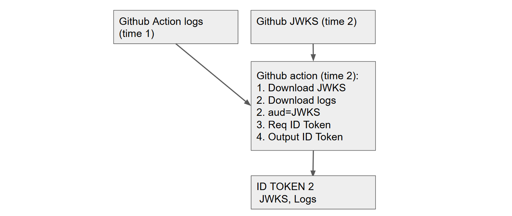

<div>
        
</div>

**tl;dr** *- Instead of a complex Trusted Execution Environments like Intel SGX or AWS Nitro Enclave just use Github Actions.*

> One day while browsing the web you see an article on nasa.gov that says “scientists discover dragons are real.” You want to tell your friends that NASA is saying dragons are real, but then NASA deletes the article. You need a way to cryptographically prove nasa.gov had that article even after it is removed. To do this you need an oracle, more specifically need a TLS notary.

[GitHub Actions (GHA)](https://github.com/features/actions)[^1] is far more powerful than it appears at first.
In this post I will look at an off-label use of GitHub Actions which allows it to be used as an oracle that can sign and notarize web content, including a TLS notary.
This allows a party to prove what content was on a website long into the future without requiring that anyone trust that party.
All anyone needs to trust is trust Github; not a github repo or a specific Github Action, but Github.
At the end we show how remove Github as a trusted party[^2].

The incredible James Carnegie ([kipz](https://github.com/kipz)) has written a working implementation of the ideas in this blog post:

* **URL Oracle** - A Github Action that implements a TLS notary for any URL" [github.com/kipz/url-oracle](https://github.com/kipz/url-oracle/)
* **BBC Technology News Oracle** - An example use of URL Oracle that creates and verifies attestations for the BBC Technology RSS feed content to ensures the integrity and authenticity of BBC Technology news content through cryptographic attestations. [github.com/kipz/bbc-tech-news-oracle](https://github.com/kipz/bbc-tech-news-oracle/tree/main)

**Disclaimer:** While the features of GitHub Actions and GitLab-CI enable this functionality, this is an off-label use.
This is preliminary research, do not use this without first consulting with your cryptographer.
If you notice an increased appetite for trusted third parties, discontinue use immediately.

## What our GitHub Action’s oracle does

While TLS notary is our main use case the functionality provided by this design goes well beyond a notary and provides an oracle for general purpose attestation of computation, i.e. [Trusted Computing](https://en.wikipedia.org/wiki/Trusted_Computing)!
Such oracles are a useful and highly sought after security primitive for everything from software supply chain security, to blockchains and to cryptography.
We discuss these applications at the end of the post including how to use this oracle in OpenPubkey.

The oracle we create from GitHub Actions should have the following properties:

* **General Purpose:** It will execute any program you give it.
* **Attestation:** It will attest to the program it executed and the output of that program by signing the hash of the program and the hash of the output of the program.
* **Publicly Verifiable:** This signature can be verified using GitHub’s public key.
* **Only Trust GitHub:** The person who manages, configures and triggers the GitHub Action can not make the oracle lie or attest to the wrong program or output.

**GitHub Actions (Program P):** → GitHub’s Signature on: `(SHA-1(P), SHA-1(Output of P))`

**Is SHA-1 safe?** No, [but the SHA-1 hash function used by GitHub and git is not actually SHA-1](https://github.blog/news-insights/company-news/sha-1-collision-detection-on-github-com/), but SHA1-DC, a variant of SHA-1 that has been [hardened against collision attacks](https://github.com/cr-marcstevens/sha1collisiondetection).

## Background on GitHub Actions

GitHub Actions works by running a program in a github repo based on a workflow configuration file in that repo. Github spins up a container, downloads the repo into that container and then runs commands specified in the workflow config file. For instance for our oracle we tell it to checkout the repo, setup go, and run the main.go file.

```yaml
steps:
- name: Checkout code
    uses: actions/checkout@v4

- name: Set up Go
    uses: actions/setup-go@v4
    with:
    go-version: 1.20.8

- name: Run Oracle
    run: go run main.go
```

GitHub provides the ability for a program running in a GitHub Action to request an OpenID Connect ID Token from GitHub.
Requesting this ID Token is simple: `core.getIDToken(audience)`, where audience can be any arbitrary string chosen by the program.
GitHub Actions will then return an ID Token signed by GitHub[^3].
GitHub ID Token’s look like:

```json
{
  "aud": <audience string specified by program>,
  "sha": <SHA-1 of the repo>
  "repository": "octo-org/octo-repo",
  "workflow": "example-workflow",
  "job_workflow_sha": <SHA-1 workflow commit>,
  "iss": "https://token.actions.GitHubusercontent.com",
  "exp": 1632493867,
  "iat": 1632493567
   … // Truncated
}
```

## How to turn GitHub Actions into an oracle

An oracle needs to sign two things:

* The hash of the program it ran
* The hash of output it got from the program when it ran the program.

The ID Token already contains the hash of the program.
The only thing missing is the hash program output.
Remember when requesting an ID Token from GitHub the program specifies a string of its choice and GitHub sets that string as the audience in the ID Token.
Thus, to turn GitHub into an oracle, the program requests an ID Token with an audience set to the hash of the program's output.

For example to create a GitHub Action in which GitHub attests to the front page of nasa.gov, create a workflow file in a GitHub repository that:

1. Downloads <https://nasa.gov> as nasa-data
2. Requests an ID Token from GitHub: `idt = core.getIDToken(SHA256(nasa-data))`
3. Posts (idt, nasa-data) somewhere public

Anyone who sees (idt,nasa-data) can verify that the oracle attests to the front page of (idt,nasa-data):

<div>
        
</div>

1. **Check ID Token:** Perform standard OIDC verification on the ID Token, idt, including downloading GitHub’s public key from their JWKS[^4] URI ([token.actions.githubusercontent.com/.well-known/jwks](https://token.actions.githubusercontent.com/.well-known/jwks)) and verifying the signature on idt.
2. **Check Program:** Use the ID Token `repo` claim to find the GitHub repo which created this idt. Check that the code of the program that ran is correct and that this code hashes to the `sha` claim in idt.
3. **Check Program output:** SHA256(nasa-data) and check that it matches the audience claim in idt.

## Dealing with key rotations

GitHub rotates the keys that sign their ID Token’s every few weeks.
In the above scheme, once the public key that verifies GitHub’s signature on the ID Token is rotated off GitHub’s JWKS URI, no one will be able to verify GitHub’s signature.


<div>
        
</div>

There are two solutions for this.
First, we could leverage GitHub’s key rotation policy to chain attestations about JWKS backwards by making attestations about the keys in the JWKS URI.
Second, we could use the fact that GitHub Action output is stored in logs which can be downloaded by a program running in a GitHub Action.


GitHub always has two public keys at the JWKS URI. An old public key and a new public key.
All new ID Token signatures verify under the new public key with the old public key existing to ensure previously issued ID Tokens have a verification grace period.
This means if we use our oracle, a ID Token today can attest to the state of JWKS which includes the public key used today and the public key used two weeks ago.
This enables us to attest to the public key used three weeks ago, which then allows that ID Token to attest to the public key used six weeks ago and so on.

<div>
        
</div>

There is one issue with this approach.
If GitHub for some unexpected reason were to rotate both keys at once it would break the chain.
This could be addressed by having overlapping GitHub Actions that continuously request ID Tokens, so that if at least one of our oracles is running when the rollover happens it can be attested to the previous state of the JWKS.
This is a complete solution as it is not robust to GitHub going down while rotating both keys at the same moment.

Fortunately there is a far better approach.
When a program runs in a GitHub Action, that program’s output is logged by GitHub and those logs can be read by programs running in a GitHub Action.
Our GitHub Action program can attest to the current GitHub Action public keys in the program output and then write the ID Token to this log.
As GitHub records the SHA-1 hash of the program in the log,
the log functions as an attestation of the program and the program output.
The log is not signed, but it is controlled by GitHub.

We can take this even further, each time our GitHub Action oracle runs, it downloads the past logs, and attests them as program output in the ID Token.
Thus, GitHub’s signature now covers the past logs and covers the past state of GitHub’s public keys.
The ID Token produced by the oracle attests to all previous logs, so we can prove the content of a log even after the 90 day window after which GitHub deletes the log.
This enables us to chain attestations backwards indefinitely in time.

<div>
        
</div>

A by-product of using our oracle to chain attestations backwards using github logs is that it allows us to create a [timestamping authority](https://en.wikipedia.org/wiki/Trusted_timestamping).
Since each ID Token contains the date at which it was issued, it not only attests to the program’s output, but also the time at which it was run.

## What if I don’t want to trust GitHub?

To remove trust in GitHub Actions we build a GitLab-CI oracle.
GitLab-CI provides very similar functionality to GitHub Actions.
Build an oracle out of GitLab-CI and have our GitLab-CI oracle check the GitHub’s oracle and have the GitHub oracle check the GitLab-CI oracle.
GitLab-CI does not provide the same audience functionality as GitHub, but we can use [the technique we discuss here to achieve similar functionality](https://web.archive.org/web/20240807093138/https://www.bastionzero.com/blog/generalizing-openpubkey-to-any-identity-provider).

<div>
        
</div>

Instead of a complex and expensive Trusted Execution Environments (TEE) like [intel SGX](https://en.wikipedia.org/wiki/Software_Guard_Extensions) or [AWS Nitro Enclave](https://aws.amazon.com/ec2/nitro/nitro-enclaves/) just use Github Actions.
You might ask, "you can, but should you?" and I leave that question to the reader.
There was a pretty bad cache poisoning attack in Github Actions (see Adnan Khan's [The Monsters in Your Build Cache - GitHub Actions Cache Poisoning ()](https://adnanthekhan.com/2024/05/06/the-monsters-in-your-build-cache-github-actions-cache-poisoning/) and Barak Brudo's [GitHub Cache Poisoning](https://scribesecurity.com/blog/github-cache-poisoning/) and likely there is a lot of attack surface.
However this approach can always be combined so that their no single point of failure.
If you AWS Nitro Enclaves + Github Actions is stronger than Github Actions.
By combining more and more oracles together you can build a truly impressive level of security.

## Why are oracles valuable?

Oracles solve a number of problems at the expense of requiring that the oracle be trusted. For instance, let’s say you want to run a computation on some secret data, you want to prove that the output of the computation is correct, but you want to keep parts of the data used to run the computation. Just give the oracle your program, the data, and it will sign an attestation that a particular program, when run with access to the secret data, produced a particular output.

We specifically invented the Github Actions oracle approach because our project [OpenPubkey](https://github.com/openpubkey/openpubkey) would benefit from being able to prove the JWKS.

GitHub makes an excellent trusted third party because you probably already trust GitHub. Even if you don’t use GitHub, much of the source code of the software you use is stored and controlled by GitHub. Projects that don’t use GitHub use dependencies are on GitHub. There are very few systems that are secure against a malicious GitHub.

## Related Work

There has been much work on TLS notaries.
[Town Crier: An Authenticated Data Feed for Smart Contracts (2016)](https://eprint.iacr.org/2016/168.pdf) [town-crier.org](https://www.town-crier.org/) which uses a TEE (Trusted Execution Environment) to notarize web content.
TLS Notary, [tlsnotary.org](https://tlsnotary.org/) uses [Multi-Party Computation (MPC)](https://en.wikipedia.org/wiki/Secure_multi-party_computation) so that a third party can notarize content without having to reveal that content to the notary.
[Chainlink](https://en.wikipedia.org/wiki/Chainlink_(blockchain_oracle)) is a blockchain-based oracle and TLS notary built our of a network of many oracles which are are incentivized and punished if they misreport.

The Sui and Aptos blockchains both treat the content in JWKS URIs as consensus critical and consensus nodes function as oracles reporting the current content on JWKS URIs when they produce blocks.
Become of this these blockchains produce a long term archive log of these states as part of their blockchains.
I have [an draft PR in OpenPubkey to use Sui as an archival JWKS oracle](https://github.com/openpubkey/openpubkey/pull/102).
Unfortunately they don't support the github or gitlab JWKS URI.

## See Also

* [OpenPubkey (Augmenting OpenID Connect with User held Signing Keys): Why I think it is the most important security research I’ve done](https://www.ethanheilman.com/x/30/index.html)

* [Castle meet Cannon: What to do after you lose?](https://www.ethanheilman.com/x/4/index.html)

[^1]: GitHub Actions (GHA) is an automation service provided by GitHub where git repos can be configured to automatically run programs against the code in the repository. Typically used for running automated tests against proposed changes or to automatically build and deploy software artifacts as part of a [CI/CD pipeline](https://en.wikipedia.org/wiki/CI/CD).

[^2]: "Trust No One"

[^3]: Following OIDC convention GitHub publishes the public keys needed to verify their signature on ID Tokens at a [well-known JWKS URI](https://token.actions.githubusercontent.com/.well-known/jwks).

[^4]: JWKS (JSON Web Key Set) defined in [RFC 7517 - JSON Web Keys](https://datatracker.ietf.org/doc/html/rfc7517)
