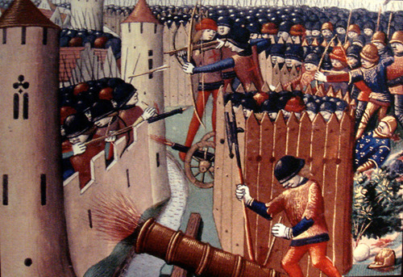
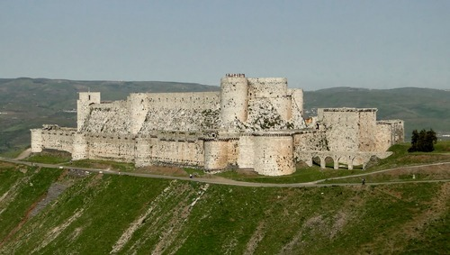
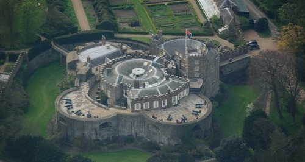
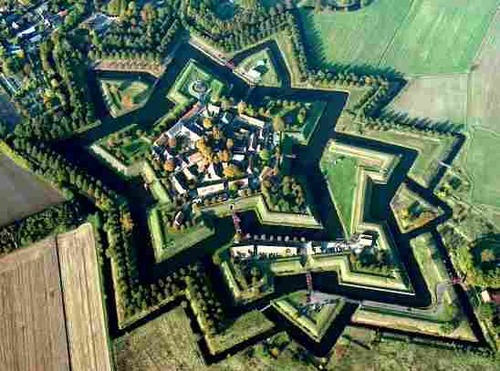
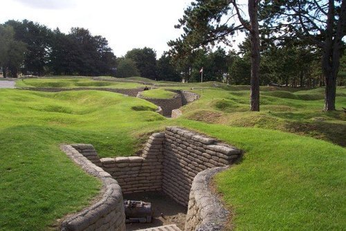
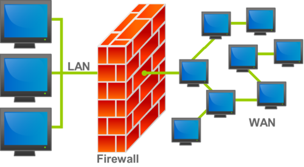

Most strategies are based around winning but what happens if you can't win? 

[In my last post I talked about flipIt.](http://ethanheilman.tumblr.com/post/27452522888/fflipit-an-interesting-game)
One of the things that fascinates me about flipIt is it forces you to think about what you do when defense is impossible.
In this post I'll explore the evolution of fortress and castle building from the 12 Century to WW1 and it's implications for network security.

**Early Fortifications**

Fortifications in 12th Century and before (pretty much all the way into the classical era) were designed to keep enemy soldiers outside the perimeter of the fort (such a fort is picture above).
Doors were recognized as weak points which could be set on fire or smashed in and so the fortifications were designed to protect these vulnerable areas by reducing their surface area and allowing defenders to concentrate projectile and other violence against attackers approaching the doors.
The more robust fortifications had two static lines of defense. 
If the first wall was breached the defenders could fall back to a second inner wall.
Often to the fortification's credit attackers choose to starve the defenders out rather than attempt to breach the walls.
Winning was successfully holding a static perimeter.

**Device Fort**

With the introduction of gun powder and use of cannons in Europe, fortifications came under greater threat. 
The general response was to mitigate the effect of cannons through rounder thicker walls, lower towers, and to place cannons on the wall themselves to provide a deadly response to the besieging cannons.
In 1539 Henry VIII carried out such a program of fort modernization in Southern Europe and these fortifications became known as [device forts](http://en.wikipedia.org/wiki/Device_Forts). A device fort is pictured above, notice the thick circular squat walls designed for deflecting gunpowder weapons.

**Star Forts**

Unfortunately for defenders cannons kept getting stronger and building thicker castle walls hit a point of diminishing returns in terms of defensive utility and increasing cost. 
While cannons can easily destroy castle walls, (re)building castle walls is a extremely expensive. 
Furthermore stone and brick walls are static lines of defense that, by design, can not be easily moved to react to changes.
A fort which was once strategically important is now left defending nothing of value.

The last of this approach of increasingly expensive threat mitigation was the beautiful star fort (shown above). 
Star forts had very short thick angled walls to defect projectiles and overlapping fields of fire to create a [stand off](http://en.wikipedia.org/wiki/Standoff_distance) distance.

**Game Over:**
Again the power of cannons and artillery increased making even star forts highly vulnerable. 
Relying on the idea that walls could create an effective perimeter to keep attackers out now guaranteed failure.
Defenders could no longer maintain an unbreakable perimeter.
They had lost, and what happened next as interesting and successful as it's results were terrible.

**Trench Warfare**

The solution was [trench warfare](http://en.wikipedia.org/wiki/Trench_warfare). 
Trenches are cheap to build and repair.
A defender can afford to build [many lines of trenches if the first series of trenches are taken](http://en.wikipedia.org/wiki/Defence_in_depth).
Additionally if a particular trench position is destroyed or overwhelmed, new trench formations can be built quickly to respond to the changing dynamic. 
Combined with machine guns and barbed wire, trench warfare tilted the balance of war strongly in favor of defenders[^3].

**Resiliency over Robustness:** 
Perimeters were still impossible to defend, defenders still always lost, but it did not matter since new perimeters could be built before an attacker could take advantage of their success[^4]. 

This was the triumph of [resiliency of humans + shovels over the robustness of stone walls](http://www.resilientcommunities.com/you-choose-the-strategy-robust-or-resilient/).
If losing is cheap enough you can still always lose and end up winning.

**Stonewalls and Firewalls**

This arms race of perimeter defense with increased cost and decreasing effectiveness has been mirrored in network security.

* First we tried securing of our networks by requiring credentials to gain access and reducing surface area (protecting doors).

* After that failed we added [chroot jails](http://en.wikipedia.org/wiki/Chroot), firewalls, automatic updates and [IDS](http://en.wikipedia.org/wiki/Intrusion_detection_system)(second lines of defense, making the walls thicker). We added [VPNs](http://en.wikipedia.org/wiki/Virtual_private_network), [sandboxing](http://en.wikipedia.org/wiki/Sandbox_(computer_security)), and [trusted computing chips](http://en.wikipedia.org/wiki/Trusted_Computing) creating star forts with multiple static fallback positions.

While all of these protections raise the security of our networks they are fundamentally based on holding a series of static perimeters. 
They are designed to raise the cost of an attack, but they also raise the complexity and cost of defending.

All the money that google spends on defending their network perimeter was completely defeated by an [IE zero day](http://en.wikipedia.org/wiki/Operation_Aurora#Attack_analysis).

**Some Ideas**

We need to accept the fact that there is [no such thing as a secure perimeter](http://www.veracode.com/blog/2009/06/the-mobius-defense-%E2%80%93-an-impetus-for-application-security/)[^1], that all of our most trusted systems will be repeatedly compromised, that defenders can never win.
What do we do after we have lost?
Reduce the cost of losing to the point that losing becomes affordable.

This list is written in goal -> method format.

* Increase the speed and the decrease the cost of recovering from a compromise -> we have a factory reset button on mobile phones why not on servers.
* Decrease the cost of data loss -> protect data rather than perimeters[^2].
* Don't be dependent any on part of your network -> release [the chaos monkey!](http://www.codinghorror.com/blog/2011/04/working-with-the-chaos-monkey.html)
* Stay alert -> use tools to process, analyze and view log files even when nothing is going wrong. Add log files to your feedback loop, they are your eyes.
* Hedge system integrity checks with things you don't control -> use google analytics to check your work, send checksums of files by email to a gmail account who's password no one knows and is stored in a company safe.
* Stay nimble -> value software/hardware that can be easily and quickly altered/changed ( see [the unix philosophy](http://en.wikipedia.org/wiki/Unix_philosophy) ), create the same system twice with two teams randomly fall over between the two systems, build layers of abstract to allow rapid transitions.
* Increase organisational agility ->  try multiple approaches to the same problem in parallel rather than in series. allow people to take risks, provide a space for people to change their minds without looking bad, [make decisions locally and quickly and then iterate on the feedback](http://en.wikipedia.org/wiki/Power_to_the_edge),

**tl;dr**
Central claim is that: (1). After a certain point in an arms race security strategies based on increasing the cost that an attacker must pay to succeed hit diminishing returns. 
(2). After this point the best strategy is to reduce the cost that a defender must pay when an attack succeeds.

[^1]: Can anyone point me to a working link for Herzog's talk "The Mobius Defense" slides. I read them a few years ago but all the links to it seem dead.

[^2]: The idea that perimeters are easily broken so instead make everything a perimeter has been tried [as a national ground warfare strategy in Albania](http://en.wikipedia.org/wiki/Bunkers_in_Albania).

[^3]: The reader should be careful to note that trench warfare was not the final development in defensive tactics and it was been quickly eclipsed by new offensive strategies including [maneuver warfare](http://en.wikipedia.org/wiki/Maneuver_warfare) (which predates trench warfare), [infiltration tactics](http://en.wikipedia.org/wiki/Infiltration_tactics) (which was developed in response to trench warfare) and [aerial warfare](http://en.wikipedia.org/wiki/Aerial_warfare) (which renders trench warfare [suicide](http://en.wikipedia.org/wiki/Gulf_War_air_campaign#Vulnerability_of_Iraq_to_air_attacks) without sufficient air defense).
That being said, trench warfare with the addition of other tactics remains widely used in modern conflicts almost unchanged from its initial conception.

[^4]: This strategy can also be seen in the development of armored knights. 
In response to gunpowder weapons, [personal armor](http://en.wikipedia.org/wiki/Personal_armor) was strengthened (using new alloys) and thickened.
This hit diminishing returns at which point armies switched to large numbers of unarmored conscripts.
