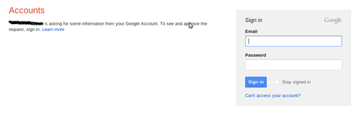
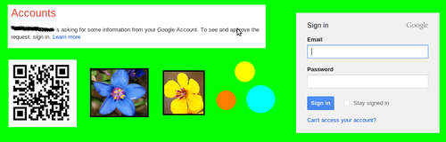

**Disclaimer:** The following post is uses Gmail and [Google Accounts](http://en.wikipedia.org/wiki/Google_Account) as a punching bag, but these problems discussed are both widely known, universal to identity providers on the web and not Google's fault.
Gmail has just been chosen to play the victim only due to it's popularity and general [bestness](http://en.wiktionary.org/wiki/bestness).

Password [phishing](http://en.wikipedia.org/wiki/Phishing) attacks have been going on for [over 25 years](http://en.wikipedia.org/wiki/Phishing#cite_note-8) and the situation has only gotten worse.
This post argues that by using a browser plugin to customize login pages on the client, attacks will have significantly greater difficulty forging believable login pages.

## Two Phishing Attacks

I will argue this point by first showing two phishing attacks which would probably fool a fairly sophisticated computer user.
These attacks are almost definitely not novel and are probably used in the wild. 
Compare these attacks to [typical advice on preventing phishing](http://www.identitytheftkiller.com/prevent-phishing-scams.php).
Consider the following two attacks:

**Fake OAuth page:** 
Websites will often allow users to authenticate with their [google account](https://support.google.com/accounts/bin/answer.py?hl=en&amp;answer=112802) using [OAuth](http://en.wikipedia.org/wiki/OAuth).
If they are not logged into their Google account already it will ask them to login[^1].
The workflow looks like this:

1. [Alice](http://en.wikipedia.org/wiki/Alice_and_Bob) goes to a site that appears to have content that Alice wants. 
2. To access the content Website requires that Alice authenticates with her Google account before making a purchase.
3. Alice clicks 'authenticate with Google' and is taken to a Google accounts login screen.
4. Alice enters her username and password and is then allowed into the site.

Eve wants to steal Alice's password so she setups up a website as above but in step 3 Alice is sent to a fake, but realistic looking gmail login page.
Alice just gave her username and password away.
Eve can interactively check if Alice's provided a real username/password by supplying it to Gmail to see if it works.
If Alice had [Two-Factor authentication](http://en.wikipedia.org/wiki/Two-factor) setup Eve can merely request a verification code from Alice as part of the login request.
In fact if Eve wants to change the password and lock Alice out of her own account she can claim that the first verification code that Alice supplied (as part of her second factor) was incorrect and ask for a second one (loading the page for 60 seconds to wait for the first verification token to expire).

**Tabnapping:**
Gmail has a habit of signing users out of their gmail accounts, which has trained users to sign back in at random points during the day.
This can be exploited by crafting a page which when it [detects that the user is inactive or idle](http://paulirish.com/2009/jquery-idletimer-plugin/) it transforms into a fake gmail page saying that user has been logged out and that they should login again. This general approach is called [tabnapping](http://en.wikipedia.org/wiki/Tabnabbing).

1. Eve sents Alice a link to a fake Google Doc.
2. Alice opens link and goes to bed, while she is sleeping the fake Google Doc rewrites itself so that it looks like a "you've been logged out, please login here" Google page.
3. Alice wakes up, checks her laptop, logs into the fake Google login page. Game over.

## Objections

**Alice should be able to notice that she is signed into Google in other tabs:** 
As [Google says]:(http://www.google.com/about/company/rewardprogram.html)
&gt;"At this time, the [ability of malicious web sites to log users out of unrelated web applications is essentially unavoidable](http://scarybeastsecurity.blogspot.com/2010/01/logout-xsrf-significant-web-app-bug.html); it is a consequence of how the web is designed, and cannot be reliably prevented by any single website."
This means that Eve can log Alice out of her Google Account. 
In fact Eve can keep logging Alice out until Alice logs into Eve's fake Google Account.

**Alice can tell the difference between the fake login page and the real login page by inspecting the URL:**
Unfortunately there are [really effective ways](http://en.wikipedia.org/wiki/IDN_homograph_attack) of making fake but undetectable urls (see also [URL redirecting](http://en.wikipedia.org/wiki/URL_redirector#Manipulating_visitors)).

**Alice uses HTTPS so she is safe:** 
Phishing sites legally acquire valid HTTPS certificates.
HTTPS offers zero protection in this scenario, other than the minimal cost to request a cert for a domain they control.

## A Solution

The crux of the problem is that users have no way[^2] of telling a real Google accounts or Gmail login page from a fake one since the styling of a login page can be easily copied.

**Customize/Skin the Login Page:**
Users will often skin or customize the look of the internal gmail web application by choosing a theme. Google should force new users to choose a unique skin for their 'trusted' home computer and persist this skin even when they are not signed into their Gmail account so that the skin will be applied to the login screen for their Gmail account.
This skin would persist on the client [^5], so an attacker would not be able to learn it by querying Google.
Since the attacker can't learn the skin that user is using, the attacker can't replicate what the user expects to see.
Thus the attacker will have difficulty fooling the user[^3].
An example skin is shown below.

**qr-codes:** For added security the page could display a qr-code which the user could scan with their mobile phone to log themselves in without typing in a password.
[Isaac Potoczny-Jones](http://corp.galois.com/isaac-potoczny-jones/) has a neat [blog post on using qr-codes as authentication](http://corp.galois.com/blog/2011/1/5/quick-authentication-using-mobile-devices-and-qr-codes.html)[^4].
 
## Problems

There are several problems with training users to use the look of a website to determine its trustworthiness. 

* The unique skin is now acting as a authentication to the user, but browsers and security models are not designed to protect how gmail looks to a user. Screen sharing skype sessions, xss attacks and photos could expose the look of the skin which then an attacker could copy.
Since the user now trusts login pages that have their unique skin they will be easier to fool if the skin is compromised. 

This is a real risk, but users already use the look of a webpage to judge it's trustworthiness. Most phishing attacks are not targeted and  this would stop these sorts of attacks and seriously complicate more advanced attack.

* The unique skin can not persist across clients. The first time a user uses a computer they have to login to a plain page or a page which has the skin of another user.

This solution probably wouldn't be that useful for people that use many different computers. 

* Chrome already has this functionality in [that you can sign into chrome.](http://support.google.com/chrome/bin/answer.py?hl=en&amp;answer=185277). Since you are signing into the browser rather than into webpage phishing is impossible.

Unfortunately, signing into Google Chrome does not automatically sign you into all your Google Accounts. 
Passwords can be saved in Google Chrome, but there are numerous ways to trick someone into entering their password into a realistic looking login screen.

[^1]: For an example how legitimate sites do this go to [goodreads.com](goodreads.com) in safe/incognito mode and click on the "sign in using Google" button. 

[^2]: Yes, yes, they can check the certificate of the page and maybe catch a poorly generated cert, but how many times do you check the certificate of the page when you login to Gmail?

[^3]: All users can be fooled given enough time and effort.

[^4]: I don't see any reason why Google is not doing this already. They support Two-Factor authentication. While qr-auth is as vulnerable as username/password schemes, a successful attack only steals a one-use token rather than a username and password. This would be perfect for situations in which someone is concerned about a keylogger. In fact if you combine qr-auth with a browser plugin it becomes more secure than username/password schemes since the plugin can verify if the page is gmail or not.

[^5]: This is really the tricky part as an attacker can wipe browser cookies at will. One surefire way would be to use a browser plugin or use the Google Chrome Sync functionality.